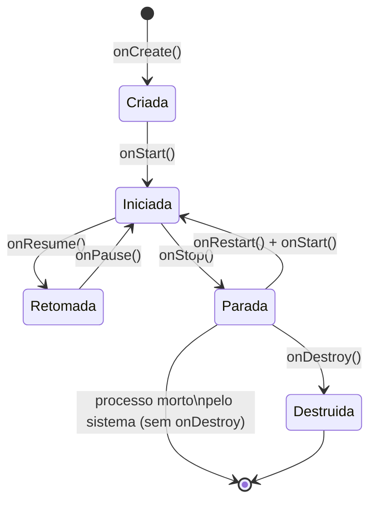

# Aula 2 — Android para quem projeta: ciclo de vida, pilha de retorno e permissões

**Carga horária:** 4h
**Unidade:** I — O smartphone e a plataforma Android como condicionantes de projeto

## Objetivos da aula

- Descrever o ciclo de vida de uma tela Android e prever o efeito de cada transição sobre o estado da aplicação.
- Explicar o funcionamento da pilha de retorno e do botão/gesto voltar.
- Relacionar o modelo de permissões em tempo de execução e os limites de segundo plano às decisões de projeto de interface.

## 1. O ciclo de vida de uma tela (Activity)

No Android, a unidade de tela visível ao usuário é tradicionalmente representada pela classe `Activity` (em Flutter e React Native, o sistema operacional ainda opera sobre uma `Activity` hospedeira, mesmo que o desenvolvedor não a manipule diretamente). O sistema operacional — não o desenvolvedor — decide quando criar, pausar, retomar ou destruir essa tela, em resposta a eventos como o usuário trocar de aplicativo, girar o aparelho ou o sistema precisar liberar memória.

> **Definição — Ciclo de vida (lifecycle)**: sequência de estados pelos quais um componente de tela passa entre sua criação e sua destruição, com pontos de entrada (callbacks) que o desenvolvedor pode usar para reagir a cada transição.

### Os estados principais

| Método | Quando é chamado | O que fazer aqui |
|---|---|---|
| `onCreate()` | Tela criada pela primeira vez | Inflar layout, inicializar componentes que existem uma única vez |
| `onStart()` | Tela prestes a ficar visível | Registrar observadores que só devem existir enquanto a tela está visível (ex.: um listener de sensor de baixo custo) |
| `onResume()` | Tela em primeiro plano, interativa | Iniciar câmera, sensores, animações |
| `onPause()` | Outra tela está sobrepondo parcialmente | Pausar animações, salvar dados críticos rapidamente (é uma chamada breve) |
| `onStop()` | Tela não está mais visível | Liberar recursos pesados (conexões, streams) |
| `onDestroy()` | Tela sendo destruída | Liberar tudo que resta |

Um ponto frequentemente mal compreendido por quem vem do desenvolvimento web: **`onPause()` e `onStop()` não significam necessariamente que o app vai ser fechado** — o usuário pode voltar a qualquer momento e o ciclo reinicia em `onRestart() → onStart() → onResume()`. Mas o sistema também **pode matar o processo** enquanto ele está parado, sem chamar `onDestroy()`, se precisar de memória — daí a importância de persistir estado relevante antes disso.

### Process death: a metade do problema que a rotação de tela não mostra

Mudança de configuração (rotação, por exemplo) é apenas metade do que pode acontecer com uma tela parada — a outra metade, mais traiçoeira porque é invisível durante o desenvolvimento normal, é o **encerramento do processo pelo sistema** (*process death*) enquanto o app está em segundo plano, sem qualquer relação com o usuário girar o aparelho. Ao voltar, o Android recria a `Activity` do zero e restaura `onSaveInstanceState()` como se nada tivesse acontecido — mas qualquer estado que não foi persistido ali, ou em armazenamento durável, se perde silenciosamente.

O comando abaixo simula esse cenário em um emulador ou aparelho com depuração USB ativada, sem esperar que o sistema decida matar o processo por conta própria — é o teste mais revelador (e mais frequentemente pulado) desta aula:

```bash
# Descobrir o nome do pacote em execução, se necessário
adb shell dumpsys window | grep mCurrentFocus

# Simular o sistema matando o processo em segundo plano (não é um "fechar app" comum)
adb shell am kill <nome.do.pacote>
```

Depois de rodar `am kill` com o app em segundo plano e voltar a ele pelo launcher, compare o resultado com o de apenas girar o aparelho: a `Activity` é recriada nos dois casos, mas só o `am kill` revela se o app depende, sem perceber, de o processo continuar vivo (variáveis estáticas, singletons em memória, streams abertos).

### Rotação de tela: o caso didático clássico

Ao girar o aparelho, por padrão a `Activity` inteira é destruída e recriada (para carregar os recursos do novo layout, se existirem variações por orientação). Um campo de texto preenchido pelo usuário, se armazenado apenas em uma variável comum, **se perde** nesse processo. Esse comportamento — que parece um defeito à primeira vista — é, na verdade, o motivo pelo qual frameworks modernos (Jetpack Compose com `rememberSaveable`, Flutter com gerenciadores de estado, React Native com bibliotecas de persistência de estado) existem: eles abstraem a necessidade de o desenvolvedor lidar manualmente com `onSaveInstanceState()`/`onRestoreInstanceState()` a cada rotação.

```kotlin
// Exemplo simplificado em Android nativo (Kotlin) mostrando
// o problema e a solução mínima sem framework de estado
class FormActivity : AppCompatActivity() {
    private var nomeDigitado: String = ""

    override fun onSaveInstanceState(outState: Bundle) {
        super.onSaveInstanceState(outState)
        outState.putString("nome", nomeDigitado) // sobrevive à rotação
    }

    override fun onCreate(savedInstanceState: Bundle?) {
        super.onCreate(savedInstanceState)
        nomeDigitado = savedInstanceState?.getString("nome") ?: ""
    }
}
```

Em Flutter e React Native o mesmo princípio se aplica em outro nível (estado do widget/componente e navegação), e será retomado nas unidades III e IV: guarde este exemplo — na Aula 9 o `StatefulWidget` do Flutter resolve o mesmo problema em outro nível de abstração, e na Aula 19 você verá o custo de resolvê-lo no lugar errado da árvore de widgets.

O ciclo completo, como grafo de estados (o formato mais fiel ao que ele realmente é — uma tabela linear esconde as transições possíveis em cada direção):



Note a transição pontilhada conceitual "processo morto pelo sistema": ela não passa por `onDestroy()` porque o sistema operacional encerra o processo diretamente, sem dar ao app a chance de reagir — é por isso que o teste com `adb shell am kill`, acima, é indispensável para validar que o estado foi de fato persistido, e não apenas mantido "por sorte" em memória.

## 2. A pilha de retorno (back stack)

O Android organiza as telas visitadas por um aplicativo como uma **pilha** (estrutura LIFO — *last in, first out*). Cada tela nova empilhada some da vista, mas permanece na pilha; o botão/gesto **voltar** desempilha a tela do topo e revela a anterior.

> **Definição — Pilha de retorno**: estrutura de dados que registra a sequência de telas navegadas dentro de uma *task*, permitindo que o usuário retorne ao estado anterior por meio do gesto ou botão voltar, na ordem inversa à navegação.

Isso tem consequências diretas de projeto:

- Uma tela de "sucesso" após um formulário (ex.: "Pedido confirmado") não deve, via de regra, deixar a tela de formulário na pilha — senão o botão voltar leva o usuário de volta ao formulário já enviado, um erro clássico de UX corrigido com `popUpTo`/`inclusive` (Jetpack Navigation), `pushReplacement` (Flutter) ou `replace` (React Navigation).
- Deep links (abrir o app diretamente numa tela específica via notificação ou link externo) precisam **reconstruir uma pilha de retorno sintética coerente**, para que o botão voltar não leve a um estado vazio ou inesperado — esse tema retorna nas Aulas 12 e 16.

## 3. Gestos de navegação do sistema

Desde o Android 10, o padrão de navegação por gestos (deslizar da borda para voltar, deslizar para cima para o início, deslizar e segurar para trocar de app) substitui os três botões virtuais tradicionais em muitos aparelhos. Implicações de projeto:

- Elementos interativos não devem ficar colados nas bordas extremas da tela, pois competem com a área de detecção do gesto de voltar do sistema.
- O aplicativo pode declarar áreas de exceção ao gesto (`setSystemGestureExclusionRects`) quando há necessidade real (ex.: um editor de desenho que usa a borda), mas isso deve ser exceção, não regra.

## 4. Notificações e canais

Notificações são o principal mecanismo pelo qual um aplicativo se comunica com o usuário **fora** da própria tela, inclusive quando o processo não está ativo. Desde o Android 8.0, toda notificação pertence a um **canal de notificação**, categoria que o próprio usuário pode silenciar ou priorizar individualmente nas configurações do sistema — o desenvolvedor não decide mais sozinho a importância de uma notificação.

```kotlin
val channel = NotificationChannel(
    "pedidos_status",
    "Atualizações de pedido",
    NotificationManager.IMPORTANCE_HIGH
)
notificationManager.createNotificationChannel(channel)
```

> **Implicação de projeto**: separar canais por finalidade (ex.: "status de pedido" vs. "promoções") desde o início — migrar notificações de canal depois de publicado o app é traumático, pois o usuário já configurou preferências sobre o canal antigo.

## 5. Permissões em tempo de execução

Desde o Android 6.0, permissões consideradas sensíveis (câmera, localização, contatos, microfone, notificações desde o Android 13) não são mais concedidas na instalação: o aplicativo precisa solicitá-las **no momento em que são necessárias**, e o usuário pode negar, aceitar uma única vez, ou aceitar permanentemente.

> **Definição — Permissão em tempo de execução (runtime permission)**: autorização que o usuário concede ou nega interativamente, no momento do uso do recurso protegido, e que pode ser revogada a qualquer momento pelo usuário nas configurações do sistema, independentemente do estado do aplicativo.

Consequência de projeto central: **o aplicativo deve funcionar (ainda que com funcionalidade reduzida) mesmo que a permissão seja negada** — pedir a permissão e simplesmente travar ou fechar se ela for recusada é uma falha de projeto, não uma falha de implementação isolada.

```kotlin
val launcher = registerForActivityResult(
    ActivityResultContracts.RequestPermission()
) { concedida ->
    if (concedida) iniciarCameraPreview()
    else exibirEstadoAlternativoSemCamera()
}
launcher.launch(Manifest.permission.CAMERA)
```

Boas práticas de projeto de interface associadas:

- Explicar **por que** a permissão é necessária antes de solicitá-la (um diálogo educativo prévio ao diálogo do sistema), especialmente quando a razão não é óbvia.
- Nunca solicitar todas as permissões possíveis na abertura do app — solicitar no contexto de uso real, aumentando a taxa de concessão e respeitando o princípio de menor privilégio.

## 6. Limites de execução em segundo plano

Já visto na Aula 1 do ponto de vista energético; aqui do ponto de vista de comportamento observável:

- Desde o Android 8.0, serviços em segundo plano sem interação do usuário têm vida útil limitada após o app sair de primeiro plano.
- `WorkManager` é a API recomendada para trabalho adiável e garantido (ex.: sincronizar dados quando houver rede disponível), pois delega ao sistema operacional a decisão de **quando** executar, respeitando as restrições de energia do aparelho.
- Localização em segundo plano requer permissão adicional e específica (`ACCESS_BACKGROUND_LOCATION`), solicitada separadamente da localização em primeiro plano desde o Android 10 — uma decisão do próprio Android para tornar mais visível ao usuário quando um app pode rastreá-lo mesmo fechado.

## 7. Exemplo real: por que "peça a permissão de localização assim que abrir o app" é um antipadrão

É comum ver, em protótipos de estudantes e mesmo em produtos reais mal projetados, a solicitação de permissão de localização disparada no `onCreate()` da tela inicial, antes de qualquer interação do usuário. O resultado observado em métricas de produtos reais: taxas de recusa muito mais altas do que quando a mesma permissão é solicitada no momento em que o usuário toca em "usar minha localização atual" dentro de um fluxo que ele já iniciou voluntariamente. Aplicativos como o Uber e o iFood solicitam localização apenas quando o usuário demonstra intenção de usá-la (abrir o mapa, buscar endereço), não na tela de splash.

## Síntese da aula

| Conceito | Regra prática de projeto |
|---|---|
| Ciclo de vida | Nunca presumir que a tela sobreviverá a uma rotação ou trocas de app sem tratamento explícito |
| Pilha de retorno | Toda navegação de "conclusão" deve considerar se a tela anterior deve continuar na pilha |
| Permissões em runtime | App deve ter um caminho funcional para o caso de permissão negada |
| Segundo plano | Preferir mecanismos que o sistema gerencia (`WorkManager`, push) a manter processos vivos manualmente |

## Leitura recomendada

- Documentação oficial: [Ciclo de vida da Activity](https://developer.android.com/guide/components/activities/activity-lifecycle) e [Visão geral de permissões](https://developer.android.com/guide/topics/permissions/overview).

## Atividade da aula

**Estudo dirigido**: em duplas, mapear os estados de uma tela de "checkout" de e-commerce hipotético (do tipo já usado como produto da equipe) e o comportamento esperado do sistema em cada uma das seguintes transições: (1) usuário recebe uma ligação durante o preenchimento do formulário; (2) usuário gira o aparelho; (3) sistema mata o processo em segundo plano por pressão de memória e o usuário volta ao app minutos depois. Entregar como tabela de estados e comportamento esperado.
