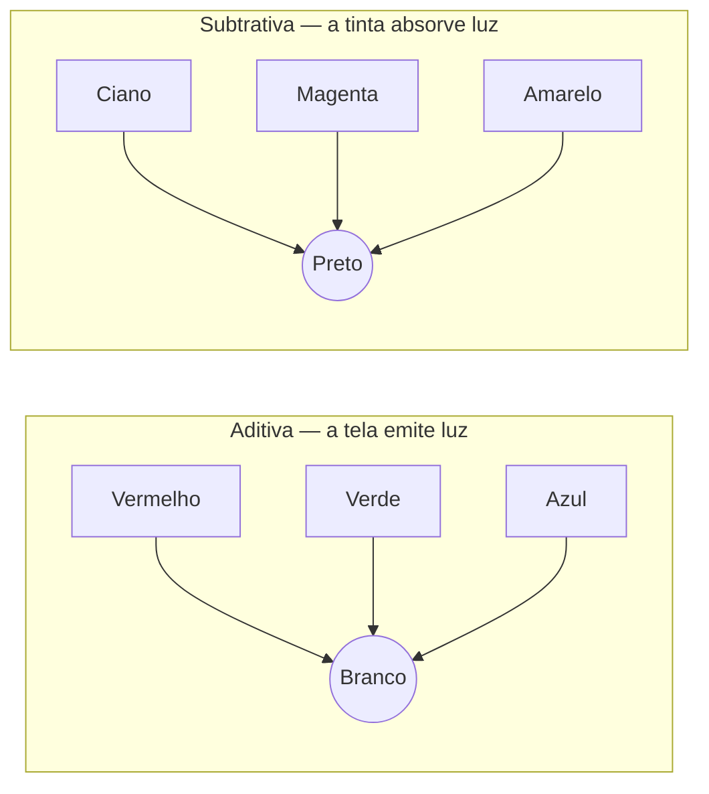
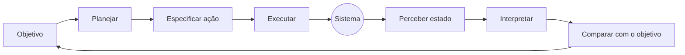

# Aula 2 — Cor, tipografia e fundamentos de UI/UX para dispositivos móveis

**Carga horária:** 4h
**Unidade:** I — O smartphone e a plataforma Android como condicionantes de projeto

## Sumário

**Parte I — Cor**

1. [Cor antes do pixel](#1-cor-antes-do-pixel)
    - 1.1 [Cores primárias e secundárias](#11-cores-primárias-e-secundárias)
    - 1.2 [Aditiva e subtrativa: o que muda no projeto](#12-aditiva-e-subtrativa-o-que-muda-no-projeto)
2. [RGB, hexadecimal e outros modelos de cor](#2-rgb-hexadecimal-e-outros-modelos-de-cor)
    - 2.1 [RGB de 8 bits por canal](#21-rgb-de-8-bits-por-canal)
    - 2.2 [Notação hexadecimal](#22-notação-hexadecimal)
    - 2.3 [HSL e HSB: modelos pensados para humanos](#23-hsl-e-hsb-modelos-pensados-para-humanos)
    - 2.4 [Por que HSL não basta: espaços perceptualmente uniformes](#24-por-que-hsl-não-basta-espaços-perceptualmente-uniformes)
    - 2.5 [Espaços de cor e gama](#25-espaços-de-cor-e-gama)
3. [Harmonia cromática e construção de paletas](#3-harmonia-cromática-e-construção-de-paletas)
    - 3.1 [O círculo cromático e os esquemas clássicos](#31-o-círculo-cromático-e-os-esquemas-clássicos)
    - 3.2 [A regra 60–30–10](#32-a-regra-603010)
    - 3.3 [Da paleta estética à paleta funcional](#33-da-paleta-estética-à-paleta-funcional)
    - 3.4 [Contraste: a restrição que decide se a paleta é utilizável](#34-contraste-a-restrição-que-decide-se-a-paleta-é-utilizável)
4. [Psicologia da cor](#4-psicologia-da-cor)
    - 4.1 [O que a pesquisa sustenta](#41-o-que-a-pesquisa-sustenta)
    - 4.2 [O que é folclore](#42-o-que-é-folclore)
    - 4.3 [Efeitos perceptuais que valem para qualquer cultura](#43-efeitos-perceptuais-que-valem-para-qualquer-cultura)
5. [Cultura, mercado e direito de marca](#5-cultura-mercado-e-direito-de-marca)
    - 5.1 [O significado da cor é aprendido](#51-o-significado-da-cor-é-aprendido)
    - 5.2 [O exemplo que sempre pega quem exporta interface: alta e baixa](#52-o-exemplo-que-sempre-pega-quem-exporta-interface-alta-e-baixa)
    - 5.3 [Cor como ativo de mercado](#53-cor-como-ativo-de-mercado)
6. [Cor na tela física do celular](#6-cor-na-tela-física-do-celular)
    - 6.1 [LCD e OLED](#61-lcd-e-oled)
    - 6.2 [Tema escuro não é "inverter as cores"](#62-tema-escuro-não-é-inverter-as-cores)
    - 6.3 [Luz ambiente e uso ao ar livre](#63-luz-ambiente-e-uso-ao-ar-livre)
    - 6.4 [Daltonismo e a regra de nunca usar cor sozinha](#64-daltonismo-e-a-regra-de-nunca-usar-cor-sozinha)
    - 6.5 [Cor dinâmica](#65-cor-dinâmica)
7. [Cor tela a tela dentro do aplicativo](#7-cor-tela-a-tela-dentro-do-aplicativo)

**Parte II — Tipografia**

8. [Tipografia: anatomia e vocabulário](#8-tipografia-anatomia-e-vocabulário)
    - 8.1 [Três palavras que não são sinônimas](#81-três-palavras-que-não-são-sinônimas)
    - 8.2 [Anatomia mínima](#82-anatomia-mínima)
    - 8.3 [Classificação](#83-classificação)
9. [Impresso e digital: dois meios diferentes](#9-impresso-e-digital-dois-meios-diferentes)
10. [Tipografia para dispositivos móveis](#10-tipografia-para-dispositivos-móveis)
    - 10.1 [sp e dp: a distinção que não pode ser errada](#101-sp-e-dp-a-distinção-que-não-pode-ser-errada)
    - 10.2 [Valores de referência](#102-valores-de-referência)
    - 10.3 [Fontes de sistema e por que preferi-las](#103-fontes-de-sistema-e-por-que-preferi-las)
    - 10.4 [Erros recorrentes em interfaces móveis](#104-erros-recorrentes-em-interfaces-móveis)

**Parte III — UI e UX**

11. [UI e UX: o que cada termo significa](#11-ui-e-ux-o-que-cada-termo-significa)
12. [Autores e teorias de referência](#12-autores-e-teorias-de-referência)
    - 12.1 [Donald Norman: o vocabulário básico do campo](#121-donald-norman-o-vocabulário-básico-do-campo)
    - 12.2 [Jakob Nielsen e a tradição da usabilidade](#122-jakob-nielsen-e-a-tradição-da-usabilidade)
    - 12.3 [As "leis" quantitativas da interação](#123-as-leis-quantitativas-da-interação)
    - 12.4 [Gestalt: como o olho agrupa antes de a mente ler](#124-gestalt-como-o-olho-agrupa-antes-de-a-mente-ler)
    - 12.5 [Sistemas de design como corpo normativo](#125-sistemas-de-design-como-corpo-normativo)
13. [UX especificamente móvel](#13-ux-especificamente-móvel)
14. [Exemplos reais](#14-exemplos-reais)

**Encerramento**

15. [Referências](#15-referências)
    - 15.1 [Cor: fundamentos e prática](#151-cor-fundamentos-e-prática)
    - 15.2 [Cor: pesquisa acadêmica](#152-cor-pesquisa-acadêmica)
    - 15.3 [Tipografia](#153-tipografia)
    - 15.4 [UI/UX: teoria e autores](#154-uiux-teoria-e-autores)
    - 15.5 [UX móvel](#155-ux-móvel)

---

## 1. Cor antes do pixel

Cor não é uma propriedade dos objetos: é uma **resposta perceptual** construída pelo sistema visual a partir de uma faixa estreita de radiação eletromagnética (aproximadamente 380 nm a 750 nm). 


O olho humano típico tem três tipos de cones — sensíveis a comprimentos de onda longos (L, "vermelho"), médios (M, "verde") e curtos (S, "azul") —, e é dessa **tricromacia** que decorre o fato de qualquer tela do mundo conseguir simular milhões de cores usando apenas três primárias.


> **Definição — Metamerismo**: fenômeno pelo qual duas distribuições espectrais fisicamente diferentes produzem a mesma sensação de cor. É o que permite que um pixel com três subpixels (vermelho, verde e azul) seja percebido como "amarelo", embora nenhuma luz de comprimento de onda amarelo esteja sendo emitida.

### 1.1 Cores primárias e secundárias


A **síntese aditiva** ocorre quando se somam cores de luz, resultando em cores mais luminosas. As cores primárias desse sistema são vermelho, verde e azul (RGB), e a combinação das três em intensidade máxima gera luz branca. As cores secundárias são obtidas pela mistura de duas cores primárias: ciano (azul + verde), amarelo (vermelho + verde) e magenta (vermelho + azul).

A **síntese subtrativa** ocorre na mistura de pigmentos ou tintas, onde a combinação de cores resulta em menos luz refletida, tornando a cor mais escura. As cores primárias desse sistema são ciano, magenta e amarelo (CMY), e a adição do preto (K) é comum na impressão, formando o sistema CMYK.

### 1.2 Aditiva e subtrativa: o que muda no projeto

A distinção mais importante para quem projeta em dois meios (tela e papel):

| | Síntese aditiva | Síntese subtrativa |
|---|---|---|
| Meio | Telas (celular, monitor, TV, projetor) | Papel, tinta, pigmento |
| Origem da cor | Luz **emitida** | Luz **refletida**, com parte do espectro absorvida |
| Primárias | Vermelho, verde, azul (RGB) | Ciano, magenta, amarelo (+ preto: CMYK) |
| Soma das primárias | Branco | Preto (na prática, um marrom sujo — daí o K) |
| Ausência de cor | Preto (pixel apagado) | Branco (o papel) |
| Gama de cores | Maior em azuis e verdes saturados | Maior em alguns tons terrosos; menor no conjunto |

Consequências práticas imediatas:

- **Um layout aprovado impresso não é o mesmo layout na tela.** Verdes e azuis vibrantes de tela (`#00E676`, `#2979FF`) simplesmente não existem em CMYK; ao imprimir, chegam apagados. O caminho inverso também falha: um Pantone metálico ou fluorescente não tem equivalente RGB.
- **No papel, mais tinta significa mais escuro; na tela, valor maior significa mais claro.** Isso inverte a intuição de quem vem do design gráfico impresso, sobretudo ao trabalhar com temas escuros.
- **O preto do papel é sempre o mesmo; o preto da tela depende da tecnologia** (ver §6.1): em OLED, é o pixel desligado; em LCD, é um filtro bloqueando uma luz de fundo que continua acesa.



---

## 2. RGB, hexadecimal e outros modelos de cor

### 2.1 RGB de 8 bits por canal

O modelo RGB descreve uma cor por três intensidades — vermelho, verde e azul — normalmente com **8 bits por canal**, ou seja, 256 níveis (0 a 255) para cada um. O total de combinações é 256³ = **16.777.216 cores** (o chamado "24 bits" ou *true color*).

```
rgb(30, 136, 229)   →   R = 30    G = 136    B = 229
```

Zero em todos os canais é preto; 255 em todos é branco; valores iguais nos três canais produzem cinzas neutros.

### 2.2 Notação hexadecimal

A notação hexadecimal é o mesmo valor RGB escrito na base 16, com dois dígitos por canal. O hexadecimal usa 16 símbolos — `0 1 2 3 4 5 6 7 8 9 A B C D E F`, em que `A` vale 10 e `F` vale 15. Dois dígitos hexadecimais cobrem exatamente 0–255 (`00` a `FF`), que é precisamente a faixa de um canal de 8 bits: é por isso que essa notação se tornou padrão.

Para converter um par hexadecimal em decimal: **primeiro dígito × 16 + segundo dígito**.

| Cor | Hex | Cálculo por canal | RGB decimal |
|---|---|---|---|
| Azul | `#1E88E5` | `1E` = 1×16+14 = 30 · `88` = 8×16+8 = 136 · `E5` = 14×16+5 = 229 | rgb(30, 136, 229) |
| Laranja | `#FF5722` | `FF` = 255 · `57` = 87 · `22` = 34 | rgb(255, 87, 34) |
| Branco | `#FFFFFF` | 255 · 255 · 255 | rgb(255, 255, 255) |
| Preto | `#000000` | 0 · 0 · 0 | rgb(0, 0, 0) |
| Cinza médio | `#808080` | 128 · 128 · 128 | rgb(128, 128, 128) |

Variações da notação que aparecem no código:

| Notação | Formato | Onde aparece |
|---|---|---|
| `#RGB` | Atalho de 3 dígitos: `#F60` equivale a `#FF6600` | CSS, web |
| `#RRGGBB` | Padrão de 6 dígitos | CSS, React Native, Figma, Android XML |
| `#AARRGGBB` | Alfa **na frente**, 8 dígitos | Android (XML e Compose), Flutter |
| `#RRGGBBAA` | Alfa **no fim**, 8 dígitos | CSS moderno |
| `rgba(r, g, b, a)` | Alfa como decimal de 0 a 1 | CSS, React Native |

> **Armadilha recorrente**: `#801E88E5` em Android é o azul com cerca de 50% de opacidade (`80` = 128, o alfa vem antes), enquanto a mesma sequência lida como CSS `#RRGGBBAA` seria uma cor completamente diferente. A posição do canal alfa muda entre plataformas.

### 2.3 HSL e HSB: modelos pensados para humanos

RGB é conveniente para a máquina e péssimo para raciocinar: ninguém consegue dizer de cabeça qual é a versão "20% mais clara" de `#1E88E5`. Os modelos **HSL** (matiz, saturação, luminosidade) e **HSB/HSV** (matiz, saturação, brilho) descrevem a mesma cor em termos manipuláveis:

- **Matiz (*hue*)**: posição em um círculo de 0° a 360° — 0° vermelho, 120° verde, 240° azul.
- **Saturação**: quão pura é a cor, do cinza (0%) à cor plena (100%).
- **Luminosidade / brilho**: quanto de branco ou de preto está misturado.

`hsl(0, 100%, 50%)` é o vermelho puro `#FF0000`. Gerar variações de um mesmo matiz — estados de repouso, foco, pressionado e desabilitado — é trivial em HSL e trabalhoso em hexadecimal.

### 2.4 Por que HSL não basta: espaços perceptualmente uniformes

HSL tem um defeito grave: **luminosidade em HSL não corresponde à claridade percebida**. `hsl(60, 100%, 50%)` (amarelo) e `hsl(240, 100%, 50%)` (azul) têm a mesma "luminosidade" no modelo e brilhos radicalmente diferentes aos olhos — o amarelo parece luminoso, o azul parece quase preto. Isso arruína paletas geradas programaticamente: girar o matiz mantendo L constante produz cores que não formam uma escala coerente.

Espaços **perceptualmente uniformes** — CIELAB, CIELCH e, mais recentemente, **OKLCH** — corrigem o problema: distâncias iguais no espaço correspondem a diferenças iguais percebidas. É o que permite a um sistema de design gerar uma rampa tonal (tons 0, 10, 20 … 100) que parece uniforme em todos os matizes. O Material 3 faz exatamente isso com o espaço **HCT** (matiz, croma, tom), derivado do CAM16 e do L\* do CIELAB.

### 2.5 Espaços de cor e gama

`#1E88E5` não é uma cor absoluta: é uma instrução de intensidade para três canais. A cor resultante depende do **espaço de cor** assumido.

- **sRGB**: padrão universal da web e presumido por omissão em Android, iOS e navegadores. Gama menor, porém previsível.
- **Display P3**: gama cerca de 25% maior, com vermelhos e verdes muito mais saturados; presente nos iPhones desde o 7 e em telas Android de topo. Uma cor P3 exibida como sRGB parece dessaturada; uma cor sRGB tratada como P3 estoura.
- **Gama (*gamma*) e linearidade**: os valores 0–255 não são lineares em relação à luz emitida. `128` não emite metade da luz de `255` — emite cerca de 21%. Isso importa ao misturar cores, aplicar transparência ou calcular contraste: é preciso **linearizar** os canais antes da conta.

---

## 3. Harmonia cromática e construção de paletas

### 3.1 O círculo cromático e os esquemas clássicos

| Esquema | Construção | Efeito e uso em mobile |
|---|---|---|
| Monocromático | Um matiz, variando saturação e tom | Interface sóbria, marca forte; risco de hierarquia fraca |
| Análogo | Matizes vizinhos (±30°) | Harmonia calma; bom para fundos e superfícies |
| Complementar | Matizes opostos (180°) | Contraste máximo; ideal para **uma única** ação de destaque |
| Complementar dividido | Um matiz mais os dois vizinhos do oposto | Contraste com menos tensão que o complementar puro |
| Triádico | Três matizes a 120° | Vivaz; difícil de equilibrar em tela pequena |
| Tétrade | Dois pares complementares | Rico e quase sempre excessivo em mobile |

### 3.2 A regra 60–30–10

Heurística de proporção herdada do design de interiores e amplamente usada em interface: **60%** de uma cor dominante (quase sempre um neutro: fundo e superfícies), **30%** de uma cor secundária (cabeçalhos, blocos, estados) e **10%** de uma cor de destaque (ações principais). Em mobile a proporção tende a ser ainda mais conservadora — algo como 70/25/5 — porque a tela é pequena e cada centímetro de cor saturada compete com o conteúdo.

> **Princípio operacional**: em um aplicativo, cor não é decoração distribuída pela tela; é **um recurso escasso, gasto em pontos de decisão**. Se tudo é colorido, nada chama atenção.

### 3.3 Da paleta estética à paleta funcional

Uma paleta de aplicativo não é uma coleção de cores bonitas, e sim um conjunto de **papéis semânticos**:

| Papel | Função | Observação |
|---|---|---|
| Primária | Ação principal e identidade | Idealmente uma por tela |
| Secundária / terciária | Ações de apoio, categorização | Opcionais |
| Neutros (5 a 12 tons) | Fundo, superfície, bordas, texto | O trabalho pesado da interface é feito aqui |
| Semânticas | Erro, alerta, sucesso, informação | Precisam sobreviver ao daltonismo (§6.4) |
| Pares "on" | Cor de texto e ícone sobre cada superfície | Garantem contraste por construção |

Esse vocabulário de papéis (`primary`, `onPrimary`, `surface`, `error`…) é o que os *design tokens* do Material 3 formalizam, e que a Aula 6 retoma em detalhe.

### 3.4 Contraste: a restrição que decide se a paleta é utilizável

Contraste não é opinião: a WCAG define um cálculo. Primeiro linearizam-se os canais (desfazendo a gama), depois calcula-se a **luminância relativa**:

```
c_linear = c / 12,92                       , se c ≤ 0,04045
c_linear = ((c + 0,055) / 1,055) ^ 2,4     , caso contrário

L = 0,2126·R_linear + 0,7152·G_linear + 0,0722·B_linear

razão = (L_claro + 0,05) / (L_escuro + 0,05)
```

O coeficiente do verde (0,7152) é muito maior porque o olho humano é mais sensível ao verde — a mesma razão pela qual sensores de câmera têm o dobro de fotossítios verdes.

Mínimos exigidos pela WCAG 2.2, nível AA:

| Elemento | Razão mínima |
|---|---|
| Texto normal | 4,5:1 |
| Texto grande (≥ 24px, ou ≥ 18,66px em negrito) | 3:1 |
| Componentes de interface e gráficos essenciais (ícones, bordas de campo, indicador de foco) | 3:1 |
| Texto normal em nível AAA | 7:1 |

Exemplo concreto e contraintuitivo, com o azul `#1E88E5` (luminância relativa ≈ 0,235):

- **Texto branco sobre esse azul: ≈ 3,7:1** — *reprova* para texto corrido; passa apenas como texto grande ou como componente.
- **Texto preto sobre o mesmo azul: ≈ 5,7:1** — *aprova* para texto corrido.

Ou seja: a escolha "óbvia" de texto branco sobre botão azul é justamente a que falha. Verificar sempre com ferramenta, antes de fechar a paleta.

---

## 4. Psicologia da cor

Esta é a área do design em que circula mais folclore. Vale separar com cuidado o que a pesquisa sustenta do que é repetido em infográficos.

### 4.1 O que a pesquisa sustenta

**Teoria da cor em contexto** (Elliot & Maier). A resposta a uma cor não é fixa: depende do contexto em que ela aparece. O mesmo vermelho aumenta a atratividade percebida em um contexto romântico e prejudica o desempenho em um contexto de avaliação (o vermelho da prova corrigida). Não existe "efeito do vermelho" — existe "efeito do vermelho **naquele** contexto".

**Duas dimensões antes do matiz.** Estudos de resposta afetiva à cor (por exemplo, Wilms & Oberfeld, 2018) mostram que **saturação e brilho** explicam mais da reação emocional do que o matiz. Cores saturadas e claras são percebidas como mais estimulantes, sejam azuis ou vermelhas. Isso é diretamente acionável: para reduzir a "agressividade" de uma tela, baixar a saturação costuma funcionar melhor do que trocar o matiz.

**Cor e percepção de marca.** Labrecque & Milne (2012) encontraram, em experimentos controlados, associações consistentes entre matizes e dimensões de personalidade de marca — azul com competência e confiança, vermelho com excitação, roxo com sofisticação, marrom com robustez — e mostraram que a **adequação percebida** entre cor e categoria de produto afeta a avaliação da marca. Bottomley & Doyle (2006) reforçam o ponto: cores "funcionais" combinam melhor com produtos utilitários, cores "sensoriais" com produtos hedônicos.

**Efeito de isolamento (Von Restorff).** O item que destoa do conjunto é notado e lembrado primeiro. Este é o mecanismo real por trás de quase todo teste A/B de "cor de botão": não é que vermelho converta mais que verde — é que a cor que **destoa da tela** converte mais que a que se dilui nela. Pintar a tela inteira de vermelho e manter o botão vermelho anula o ganho.

### 4.2 O que é folclore

- **"Cada cor tem um significado universal."** Não tem. Significados são aprendidos, contextuais e culturais (§5).
- **"Botão vermelho converte 21% a mais."** Vem de um teste A/B único, de 2011, em uma página específica, com um público específico. É um resultado, não uma lei.
- **"Uma cor de assinatura aumenta o reconhecimento de marca em 80%."** Número onipresente em apresentações, atribuído a um estudo universitário que ninguém consegue localizar. Trate como não verificado.
- **"Azul transmite confiança, logo use azul em fintech."** O que a pesquisa mostra é uma associação média, em amostras majoritariamente ocidentais, sensível ao contexto e à categoria. Serve como hipótese inicial, não como conclusão de projeto.

> **Postura profissional recomendada**: use a literatura para **formular hipóteses** e valide com usuários reais do seu público (Aula 5). Afirmações do tipo "vermelho gera urgência" só entram em um documento de projeto acompanhadas de "no nosso teste com N usuários, observamos…".

### 4.3 Efeitos perceptuais que valem para qualquer cultura

Alguns fenômenos não são culturais, e sim ópticos, e afetam diretamente a interface:

- **Cores quentes avançam, frias recuam.** Um elemento vermelho parece mais próximo que um azul de mesma luminância — útil para hierarquia, perigoso em textos longos.
- **Aberração cromática e fadiga do azul puro.** O cristalino focaliza o azul de onda curta em um plano ligeiramente diferente do vermelho; texto azul saturado sobre vermelho saturado (ou o inverso) produz uma vibração desconfortável (*cromoestereopsia*). Nunca use essa combinação em texto.
- **Contraste simultâneo.** O mesmo cinza parece mais escuro sobre fundo branco e mais claro sobre fundo preto — razão pela qual uma paleta precisa ser reavaliada por inteiro ao passar do tema claro para o escuro, e não apenas invertida.

---

## 5. Cultura, mercado e direito de marca

### 5.1 O significado da cor é aprendido

Aslam (2006), em revisão transcultural clássica para marketing, e estudos posteriores mostram divergências que quebram produtos exportados sem revisão:

| Cor | Ocidente (em geral) | Outros contextos |
|---|---|---|
| Branco | Pureza, casamento, limpeza, "vazio" | Luto e funerais na China, Japão, Coreia e em partes da Índia |
| Vermelho | Perigo, alerta, paixão, dívida | Sorte, prosperidade e casamento na China; pureza em partes da Índia |
| Verde | Natureza, permissão, saúde, dinheiro (EUA) | Sagrado no Islã; em alguns países latino-americanos, associado a doença |
| Roxo | Luxo, realeza, criatividade | **Luto e Quaresma no Brasil** e em parte da Europa católica |
| Amarelo | Atenção, otimismo | Imperial e sagrado na China histórica; associado a covardia na França |
| Azul | Confiança, corporativo | Luto no Irã; associações religiosas diversas |

### 5.2 O exemplo que sempre pega quem exporta interface: alta e baixa

Em mercados ocidentais, **verde é alta e vermelho é queda**. Na China, no Japão, na Coreia e em Taiwan a convenção é **invertida**: vermelho é alta (sorte, crescimento) e verde ou azul é queda. Um aplicativo de investimentos que localiza apenas os textos e mantém as cores comunica exatamente o oposto do pretendido para milhões de usuários. O mesmo vale para painéis de saúde, metas e desempenho.

### 5.3 Cor como ativo de mercado

Cor é o elemento de identidade reconhecido mais rapidamente — antes da forma do logotipo e muito antes do nome. Isso a torna um ativo disputado juridicamente:

- **Tiffany Blue** (Pantone 1837, o ano de fundação da marca), **roxo da Cadbury** (Pantone 2685C, objeto de longa disputa com a Nestlé no Reino Unido), **magenta da T-Mobile/Deutsche Telekom** (RAL 4010, base de notificações extrajudiciais contra outras empresas), **solado vermelho da Christian Louboutin**, **marrom da UPS**.
- **No Brasil**, a Lei da Propriedade Industrial (Lei 9.279/1996, art. 124, VIII) **proíbe registrar cores e suas denominações isoladamente**, salvo quando "dispostas ou combinadas de modo peculiar e distintivo". Ou seja: protege-se a *combinação aplicada de forma distintiva* (o roxo do Nubank aplicado ao cartão e ao sistema), não o roxo em si.

Implicações para o projeto de um aplicativo:

1. A cor primária do produto raramente é escolha livre do designer de interface — vem da marca e carrega valor econômico.
2. Cor de marca e cor de interface **não são a mesma coisa**. Uma marca pode ser roxa e a interface ser 90% neutra, com o roxo reservado às ações. Confundir as duas produz telas cansativas.
3. Aproximar-se demais da cor de um concorrente da mesma categoria é risco jurídico e de confusão de marca, não apenas falta de originalidade.

---

## 6. Cor na tela física do celular

A mesma cor `#1E88E5` chega ao usuário depois de passar por uma tecnologia de tela, um perfil de calibração de fabricante, um nível de brilho e uma condição de luz ambiente. Nada disso está sob controle de quem projeta — o que exige projetar com margem.

### 6.1 LCD e OLED

| | LCD / IPS | OLED / AMOLED |
|---|---|---|
| Emissão | Luz de fundo constante mais filtros | Cada subpixel emite a própria luz |
| Preto | Cinza escuro, com vazamento de luz | Pixel desligado: preto absoluto |
| Consumo | Praticamente constante | Proporcional ao brilho e à área clara |
| Saturação típica | Mais contida | Muito alta, às vezes exagerada de fábrica |
| Riscos | Contraste baixo sob sol | Retenção de imagem (*burn-in*), cintilação PWM em brilho baixo |
| Subpixels | RGB em linha | Frequentemente PenTile, com menos subpixels vermelhos e azuis |

Consequências de projeto:

- **Tema escuro economiza bateria em OLED**, não em LCD — a documentação do Android é explícita quanto a essa dependência da tecnologia da tela. Um fundo preto puro literalmente desliga pixels.
- **Elementos estáticos e brilhantes** (barras de navegação, marcas d'água, HUD de jogos) causam retenção de imagem em OLED após uso prolongado.
- **PenTile degrada bordas de texto colorido e fino** — mais um motivo para não usar texto de peso leve em cor saturada.

### 6.2 Tema escuro não é "inverter as cores"

O guia de tema escuro do Material recomenda, e a prática confirma:

- Usar **`#121212`** (ou uma superfície tonal equivalente) como superfície de base, em vez de preto puro. Três motivos: permite expressar **elevação por variação de tom** (superfícies mais altas ficam mais claras); reduz o *halation*, o borrão que texto branco sobre preto absoluto provoca, sobretudo em quem tem astigmatismo; e evita o esmaecimento de pretos em OLED.
- **Dessaturar as cores de marca no tema escuro.** A cor primária saturada que funciona sobre branco vibra desconfortavelmente sobre fundo escuro. O Material 3 resolve isso usando tons 80–90 da paleta tonal no tema escuro e tom 40 no claro.
- **Modular a opacidade do texto em vez de usar cinzas fixos**: 87% para texto principal, 60% para secundário e 38% para desabilitado é a convenção herdada do Material.
- O contraste continua obrigatório: temas escuros mal construídos reprovam na WCAG com a mesma facilidade que os claros.

### 6.3 Luz ambiente e uso ao ar livre

O celular é o único dispositivo usado sob sol direto, no escuro do quarto e dentro de um ônibus em movimento — às vezes no mesmo dia. Com brilho automático, a tela varia de cerca de 2 nits a mais de 1000 nits.

- Sob luz forte, o contraste efetivo despenca por reflexão: uma combinação com 4,5:1 medida no escritório pode ficar ilegível na rua. Para conteúdo crítico ao ar livre (mapa de entregador, QR code, painel de motorista), projete acima do mínimo — 7:1 ou mais.
- Cinzas muito claros sobre branco (`#F5F5F5` sobre `#FFFFFF`) desaparecem sob sol. Fronteiras entre seções precisam de outro recurso além de uma diferença sutil de tom.
- À noite ocorre o inverso: telas claras demais ofuscam. Daí a difusão dos temas escuros e dos filtros de luz azul do sistema, que **alteram as cores do seu aplicativo sem avisar** — mais um argumento para não depender de matizes precisos para transmitir informação.

### 6.4 Daltonismo e a regra de nunca usar cor sozinha

Cerca de **8% dos homens** e **0,5% das mulheres** de ascendência europeia têm alguma deficiência de visão de cores, sendo a deuteranomalia (dificuldade com o verde) a mais comum. Em uma turma de 40 alunos, é estatisticamente provável que alguém não distinga o verde de "aprovado" do vermelho de "reprovado".

O critério WCAG 1.4.1 (*Use of Color*) é categórico: **cor nunca pode ser o único meio de transmitir informação**. Acompanhe sempre de:

- ícone com forma distinta (✓ / ✕ / ⚠), e não apenas de um ícone colorido;
- texto ("Pago", "Recusado");
- padrão, espessura ou posição, no caso de gráficos;
- diferença de luminância suficiente — é o que sobrevive a qualquer tipo de daltonismo.

### 6.5 Cor dinâmica

Desde o Android 12, o **Material You** pode gerar toda a paleta do aplicativo a partir do papel de parede do usuário. Isso significa que a cor primária do seu app pode não ser a sua no aparelho do usuário. Projetar com tokens semânticos (§3.3) é o que torna esse cenário viável; escrever `#1E88E5` diretamente dentro dos componentes é o que o impede.

---

## 7. Cor tela a tela dentro do aplicativo

Cada tela tem uma tarefa diferente e, por isso, um "orçamento de cor" diferente. Aplicar a mesma paleta com a mesma intensidade em todas as telas é o erro mais comum de quem está começando.

| Tela | Papel da cor | Erros frequentes |
|---|---|---|
| **Splash / abertura** | Reforço de marca; é o único lugar em que a cor de marca pode ocupar 100% da tela | Prolongar a tela artificialmente só para exibir a marca |
| **Onboarding** | Ilustração e progresso; introduz o vocabulário cromático do app | Usar quatro matizes novos que nunca mais reaparecem |
| **Home / feed** | Neutro dominante — **o conteúdo do usuário é que deve ter cor** (fotos, capas, avatares) | Fundo colorido competindo com miniaturas e fotos |
| **Lista / busca** | Neutros, com cor apenas em filtros ativos e itens selecionados | Colorir todos os itens, destruindo a varredura visual |
| **Formulário** | Cor apenas em foco, validação e ação principal | Campos coloridos que parecem preenchidos ou desabilitados |
| **Checkout / pagamento** | Máxima sobriedade; cor reservada ao valor total e ao botão de confirmação | Vermelho de urgência em tela de pagamento, que aumenta ansiedade e abandono |
| **Sucesso** | Confirmação inequívoca: cor mais ícone mais texto | Apenas um "check" verde, ilegível para daltônicos |
| **Erro** | Vermelho semântico **no campo**, não na tela inteira | Tela inteira vermelha; ou vermelho de erro igual ao vermelho da marca |
| **Estado vazio** | Neutro e acolhedor, com uma única ação colorida | Ilustração enorme e colorida que ofusca o botão que resolve o vazio |
| **Notificação / badge** | Alto contraste em área mínima; cor de alerta apenas quando há ação pendente | Badge vermelho permanente, que ensina o usuário a ignorá-lo |
| **Mapa / navegação** | Contraste entre rota e base; precisa funcionar sob sol e no escuro | Rota em cor próxima à de vias já existentes no mapa |
| **Câmera / scanner** | Interface quase invisível sobre a imagem, com sobreposições semitransparentes | Controles claros sobre cena clara, sem sombra ou fundo de apoio |
| **Gráficos / painéis** | Escala categórica distinguível por luminância; escalas sequenciais para grandeza | Arco-íris de oito cores, sem legenda e indistinguível para daltônicos |
| **Paywall / assinatura** | Destaque do plano recomendado por contraste, não por saturação | Três planos com três cores fortes: nenhuma recomendação é lida |
| **Configurações** | Neutro absoluto; cor apenas em ações destrutivas | "Excluir conta" na mesma cor de todo o resto |

> **Teste rápido de disciplina cromática**: aplique um filtro de escala de cinza no protótipo. Se a hierarquia se mantém — o botão principal continua sendo o elemento mais destacado, erro continua distinguível de sucesso, o conteúdo continua à frente do enfeite — a paleta está fazendo o trabalho certo. Se a tela vira uma mancha uniforme, a cor estava carregando informação que a estrutura deveria carregar.

---

## 8. Tipografia: anatomia e vocabulário

Em um aplicativo, **a maior parte da interface é texto**. Tipografia não é o acabamento do projeto: é o material com que a maior parte dele é construída.

### 8.1 Três palavras que não são sinônimas

> **Definição — Família tipográfica (*typeface*)**: o desenho, o projeto das letras — Roboto, Inter, Helvetica.
>
> **Definição — Fonte (*font*)**: uma instância concreta e utilizável desse desenho, com peso, estilo e (na origem, no tipo metálico) corpo definidos — Roboto Bold Itálico 16pt; hoje, também o arquivo `.ttf`/`.otf`.
>
> **Definição — Estilo**: uma variação dentro da família — peso, largura, inclinação, largura óptica.

A analogia útil: a família é a música; a fonte é a gravação.

### 8.2 Anatomia mínima

```
   altura de ascendente
   ┌───────────────────────────── altura de maiúscula
   │  ┌──────────────────────────  altura-x
   │  │
   H  b  x  e  o  g   ← olho (contraforma) fechado em "e", "o", "g"
   │  │  │  │  │  │
───┴──┴──┴──┴──┴──┴─── linha de base
            │  │
            └──┴────── descendente ("g", "p", "y")
```

- **Altura-x**: altura das minúsculas sem ascendentes. É o fator que mais afeta a legibilidade em tamanhos pequenos — famílias de altura-x generosa (Roboto, Inter, SF Pro) permanecem legíveis a 12sp; famílias de altura-x baixa (Futura, Bodoni) não.
- **Abertura (*aperture*)**: quanto as contraformas de "c", "e", "s" ficam abertas. Aberturas fechadas fazem "e" virar mancha em tela pequena.
- **Contraste do traço**: diferença entre traços grossos e finos. Alto contraste (Didone) quebra em tela; baixo contraste sobrevive.
- **Peso (*weight*)**: 100 (Thin) a 900 (Black), com 400 (Regular) e 700 (Bold) como referências.
- **Itálico verdadeiro × oblíquo falso**: o itálico é um desenho próprio, com letras cursivas; o oblíquo sintético é a fonte normal inclinada por software. O falso é sempre pior — e é o que muitos frameworks aplicam quando a família não tem itálico instalado.

### 8.3 Classificação

| Grupo | Características | Exemplos | Uso móvel |
|---|---|---|---|
| Serifadas antigas / de transição | Hastes com serifas; eixo inclinado | Garamond, Georgia | Bom em títulos e leitura longa em telas densas |
| Serifadas modernas (Didone) | Contraste extremo entre traços | Bodoni, Didot | Perigoso: traços finos somem em tela |
| Sem serifa (grotesca / neogrotesca) | Traço uniforme, sem serifas | Helvetica, Roboto, Inter | Padrão de interface |
| Humanista sem serifa | Formas derivadas da escrita manual, mais abertas | Frutiger, Open Sans, SF Pro | Excelente legibilidade em tamanhos pequenos |
| Egípcias / slab | Serifas retangulares e pesadas | Roboto Slab, Rockwell | Títulos e identidade |
| Monoespaçadas | Todos os caracteres com a mesma largura | Roboto Mono, JetBrains Mono | Código, valores tabulares, senhas |
| Manuscritas e display | Desenho expressivo | Lobster, Pacifico | Somente em peças de marca, nunca em interface |

A classificação Vox-ATypI, adotada por associações de tipografia, é a referência formal — foi **descontinuada como padrão pela ATypI em 2021**, por limitações em relação a escritas não latinas, mas segue sendo o vocabulário mais usado no ensino.

---

## 9. Impresso e digital: dois meios diferentes

| Aspecto | Impresso | Digital / móvel |
|---|---|---|
| Unidade de medida | Ponto (1 pt = 1/72 pol), paica, cícero | px, **dp** (densidade independente), **sp** (escalável), pt no iOS, rem/em na web |
| Resolução | 300 a 2400 dpi | 160 a 640 dpi; 1 dp = 1 px a 160 dpi |
| Suporte | Tinta que absorve luz sobre papel | Luz emitida diretamente no olho |
| Dimensão | Fixa e conhecida no projeto | Desconhecida: o mesmo texto reflui de 4,7" a um tablet dobrável |
| Controle do autor | Total — a página final é a projetada | Parcial — o usuário muda escala de fonte, tema, orientação e zoom |
| Distância de leitura | 30 a 45 cm, estável | 25 a 40 cm, instável, em movimento |
| Correção de erro | Impossível após impressão | Contínua, por atualização |
| Medida da linha | 45 a 75 caracteres (Bringhurst) | 30 a 40 caracteres em telefone retrato |
| Entrelinha típica | 120% a 145% do corpo | 140% a 160% do corpo |
| Renderização | Química, estável | Rasterização com *hinting* e antisserrilhamento, variável por sistema |

Diferenças que mudam decisões concretas:

- **Luz emitida cansa mais e "engorda" o traço claro.** Texto branco sobre fundo escuro parece mais pesado que o mesmo texto preto sobre branco, por *halation*. Por isso, no tema escuro, muitas vezes é preciso **reduzir um peso** (usar Regular onde o tema claro usa Medium).
- **O usuário controla o tamanho.** No impresso, 10 pt é 10 pt. Em Android e iOS, o usuário pode ampliar o texto do sistema em até 200% — e a interface tem que continuar funcionando (WCAG 1.4.4). Isso torna alturas fixas de componentes e textos em uma única linha uma fonte permanente de defeitos.
- **Pixels são discretos.** Traços muito finos caem entre pixels e são resolvidos por antisserrilhamento, que os transforma em cinza borrado. Pesos Thin e Light abaixo de 16sp são ilegíveis na prática.
- **A fonte pode não chegar.** No impresso a fonte está no arquivo enviado à gráfica. Em digital ela precisa ser embarcada (custo de tamanho de app) ou baixada (custo de rede, mais FOIT/FOUT: texto invisível ou texto trocando de fonte na frente do usuário).
- **Fontes variáveis mudaram a economia do problema.** Um único arquivo de fonte variável carrega eixos contínuos (`wght`, `wdth`, `opsz`, `slnt`) e substitui de 4 a 12 arquivos estáticos — menos bytes, mais flexibilidade. Roboto Flex e Inter são exemplos disponíveis gratuitamente.
- **Justificação alinhada nos dois lados quase nunca funciona em mobile.** Sem hifenização decente e com linhas de 30 caracteres, o resultado são "rios" de espaço em branco. Alinhe à esquerda (ou ao início da linha, em interfaces que suportam RTL).

---

## 10. Tipografia para dispositivos móveis

### 10.1 sp e dp: a distinção que não pode ser errada

> **Definição — dp (*density-independent pixel*)**: unidade abstrata equivalente a um pixel em uma tela de 160 dpi, convertida pelo sistema conforme a densidade real do aparelho. Usada para dimensões, espaçamentos e ícones.
>
> **Definição — sp (*scale-independent pixel*)**: o mesmo que dp, **multiplicado adicionalmente pela preferência de tamanho de fonte do usuário**. Usada exclusivamente para texto.

Usar dp em texto é o modo mais direto de excluir usuários com baixa visão: o app deixa de responder à configuração de acessibilidade do sistema. O Android 14 introduziu ainda o **escalonamento não linear** — textos já grandes crescem proporcionalmente menos que textos pequenos, evitando títulos gigantescos.

```kotlin
// Compose: sp para texto, dp para tudo o mais
Text("Total do pedido", fontSize = 16.sp, modifier = Modifier.padding(16.dp))
```

```dart
// Flutter: usar o tema, não valores soltos; MediaQuery.textScalerOf respeita a preferência do usuário
Text('Total do pedido', style: Theme.of(context).textTheme.bodyLarge)
```

```tsx
// React Native: allowFontScaling é true por padrão — desativá-lo é um antipadrão de acessibilidade
<Text style={{ fontSize: 16 }} allowFontScaling>Total do pedido</Text>
```

### 10.2 Valores de referência

| Parâmetro | Recomendação | Origem |
|---|---|---|
| Corpo de texto | 16sp (Material `bodyLarge`); 17pt no iOS | Material 3 / Apple HIG |
| Mínimo absoluto legível | 12sp, apenas para rótulos curtos e secundários | Material 3 |
| Entrelinha do corpo | 1,4 a 1,5 vez o corpo (16sp → 24sp) | Material 3, WCAG 1.4.12 |
| Medida da linha | 30 a 40 caracteres em telefone; até 75 em tablet | Bringhurst, Butterick |
| Níveis hierárquicos por tela | 3 a 4 | Prática de sistemas de design |
| Pesos por família em uso | 2 a 3 (ex.: Regular, Medium, Bold) | Custo de download e coerência |
| Espaçamento entre letras | Ligeiramente negativo em títulos grandes; positivo em textos pequenos em caixa alta | Material 3 |

### 10.3 Fontes de sistema e por que preferi-las

- **Android**: Roboto (e Roboto Flex, variável); **iOS**: SF Pro, com *optical sizing* automático — SF Pro Text abaixo de 20pt, SF Pro Display acima; **cobertura global**: a família Noto do Google existe justamente para eliminar o "tofu" (o retângulo vazio de caractere ausente) em mais de 1000 idiomas.
- Vantagens: zero bytes baixados, renderização otimizada pelo sistema, ligaduras e métricas corretas para cada idioma, e familiaridade — o usuário já lê aquela letra o dia inteiro.
- Fonte de marca custa: tamanho de app, risco de FOIT/FOUT, e cobertura incompleta de caracteres (acentos do português costumam existir; cirílico, grego, árabe e CJK frequentemente não). Se usar fonte própria, **defina uma pilha de fallback explícita** e teste com nomes acentuados reais ("João Gonçalves d'Ávila").

### 10.4 Erros recorrentes em interfaces móveis

- **Caixa alta em blocos de texto.** Elimina a silhueta das palavras e reduz a velocidade de leitura. Aceitável em rótulos de até duas ou três palavras.
- **Pesos Light e Thin em texto pequeno**, especialmente sobre fundo colorido ou em tema escuro.
- **Texto sobre imagem sem tratamento.** Exige um gradiente, uma sobreposição escura ou um contêiner sólido; a foto muda a cada item da lista e o contraste é imprevisível.
- **Centralizar parágrafos.** Cada linha começa em uma posição diferente e o olho perde o ponto de retorno. Centralize títulos curtos, nunca texto corrido.
- **Truncar com reticências como estratégia de layout.** Se o nome do produto não cabe, o problema é o layout, não o nome. Textos em alemão são cerca de 30% mais longos que em inglês; em finlandês e russo, mais ainda.
- **Ignorar diacríticos e escritas altas.** Uma linha ajustada ao pixel para "Pedido" quebra com "Ação" ou com tailandês e devanágari, que ocupam mais altura vertical.
- **Desativar o escalonamento de fonte** para "não quebrar o layout" — é trocar um defeito visível por uma barreira de acessibilidade.

---

## 11. UI e UX: o que cada termo significa

> **Definição — Interface do usuário (UI)**: o conjunto de elementos visuais, textuais e interativos por meio dos quais a pessoa opera o sistema — layout, cor, tipografia, componentes, ícones, movimento, som.
>
> **Definição — Experiência do usuário (UX)**: a totalidade da experiência da pessoa com o produto e com a organização que o oferece, incluindo descoberta, instalação, uso, suporte, cobrança e desinstalação. Termo cunhado por **Don Norman** na Apple, no início dos anos 1990, precisamente porque "interface" e "usabilidade" eram estreitos demais para o que sua equipe fazia.

A relação, sem a analogia gasta do ketchup: **toda UI é parte da UX; a maior parte da UX não é UI**. Um aplicativo de banco com telas impecáveis e uma fila de atendimento de 40 minutos tem boa UI e péssima UX. Um app de entrega com tela feia que entrega em 20 minutos pode ter UX melhor que o concorrente elegante e atrasado.

Disciplinas que costumam ser confundidas com UI/UX e são distintas:

| Disciplina | Pergunta central |
|---|---|
| Pesquisa com usuários | Quem é a pessoa e qual é o problema real? (Aula 5) |
| Arquitetura de informação | Como o conteúdo é organizado, nomeado e encontrado? |
| Design de interação | O que acontece quando a pessoa age, e qual é a resposta do sistema? |
| Design visual (UI) | Como isso se apresenta: hierarquia, cor, tipo, ritmo? |
| Redação de interface (*UX writing*) | Que palavras exatas o sistema usa? |
| Acessibilidade | A pessoa consegue usar com leitor de tela, fonte ampliada, só com o polegar, no ônibus? (Aula 8) |

---

## 12. Autores e teorias de referência

### 12.1 Donald Norman: o vocabulário básico do campo

Em *The Design of Everyday Things* (1988; edição revista de 2013), Norman formaliza conceitos que se aplicam diretamente à tela de um celular:

| Conceito | O que é | Na interface móvel |
|---|---|---|
| **Affordance** | Relação entre as propriedades de um objeto e as capacidades do agente, que determina os usos possíveis | Uma superfície tocável em um dispositivo com tela sensível ao toque |
| **Significador (*signifier*)** | O sinal perceptível que comunica onde e como agir | A aparência de botão, o sublinhado do link, a alça de um *bottom sheet* |
| **Mapeamento** | Correspondência entre controle e efeito | Deslizar para baixo faz o conteúdo descer; a seta de voltar aponta para o retorno |
| **Feedback** | Retorno imediato e informativo da ação | Estado pressionado, indicador de carregamento, vibração de confirmação |
| **Restrição (*constraint*)** | Limitação que reduz o espaço de erro | Teclado numérico em campo de CPF; data futura desabilitada |
| **Modelo conceitual** | A explicação de como o sistema funciona que o usuário constrói | "Meus itens ficam no carrinho até eu confirmar" |

Norman também descreve os **golfos de execução e de avaliação**: a distância entre a intenção da pessoa e as ações que o sistema oferece, e entre o estado do sistema e a compreensão desse estado. Design é, em boa medida, estreitar esses dois golfos.



O lado esquerdo do ciclo é o **golfo de execução** — "consigo descobrir o que fazer?"; o lado direito é o **golfo de avaliação** — "consigo descobrir o que aconteceu?". Em mobile, o segundo é mais crítico do que em desktop: sem cursor, sem *hover* e com o dedo cobrindo o elemento tocado, o sistema precisa **dizer** o que fez.

Em *Emotional Design* (2004), Norman acrescenta três níveis de processamento: **visceral** (reação imediata à aparência), **comportamental** (prazer de uso e eficácia) e **reflexivo** (o que usar aquilo significa para a pessoa). Uma boa tela de erro é projetada nos três: não assusta (visceral), oferece uma saída (comportamental) e não humilha (reflexivo).

### 12.2 Jakob Nielsen e a tradição da usabilidade

As **dez heurísticas de usabilidade** (1994) são a ferramenta de avaliação mais usada da área — tratadas em detalhe na Aula 5. Duas contribuições complementares importam aqui:

- **Lei de Jakob**: as pessoas passam a maior parte do tempo em *outros* aplicativos, e por isso esperam que o seu funcione como os demais. Inovação em padrões de navegação e em ícones tem custo alto e benefício raro.
- **Avaliação heurística com 3 a 5 avaliadores** encontra a maior parte dos problemas graves a uma fração do custo de um teste formal.

### 12.3 As "leis" quantitativas da interação

| Lei | Enunciado | Consequência móvel |
|---|---|---|
| **Fitts (1954)** | Tempo para atingir um alvo cresce com a distância e diminui com o tamanho: `MT = a + b·log₂(2D/W)` | Alvo mínimo de 48×48dp (Android) ou 44×44pt (iOS); ações frequentes perto do polegar; bordas e cantos da tela são alvos "infinitos" no desktop, mas **não** no celular |
| **Hick–Hyman (1952)** | Tempo de decisão cresce com o logaritmo do número de alternativas: `RT = a + b·log₂(n+1)` | Menus curtos, divulgação progressiva, no máximo cinco itens na barra inferior |
| **Miller (1956) e Cowan (2001)** | A memória de trabalho comporta 7±2 itens (Miller) ou, em estimativas mais recentes, cerca de 4 (Cowan) | Não exija que o usuário memorize dados entre telas; mostre o resumo do pedido no checkout |
| **Tesler** | Toda aplicação tem uma complexidade irredutível; a questão é quem a absorve, o sistema ou o usuário | Preencher endereço a partir do CEP é o sistema absorvendo complexidade |
| **Doherty (1982)** | Abaixo de ~400 ms de resposta, a interação vira fluxo contínuo | Feedback imediato ao toque; esqueleto de carregamento em vez de tela em branco |
| **Von Restorff** | O item destoante é lembrado | Uma única ação primária por tela |
| **Efeito estética-usabilidade (Kurosu & Kashimura, 1995; Tractinsky, 2000)** | Interfaces percebidas como bonitas são julgadas mais fáceis de usar | Explica por que avaliação estética não substitui teste de usabilidade: a beleza mascara problemas reais |
| **Pico-fim (Kahneman)** | A lembrança de uma experiência é dominada pelo momento mais intenso e pelo final | Cuide especialmente do erro (pico) e da confirmação de sucesso (fim) |

### 12.4 Gestalt: como o olho agrupa antes de a mente ler

Formulados por Wertheimer, Köhler e Koffka nos anos 1920, os princípios da Gestalt descrevem como a percepção agrupa elementos automaticamente. Em interface, eles são o mecanismo real por trás do espaçamento:

- **Proximidade**: elementos próximos são lidos como um grupo. É o princípio mais poderoso do layout — mais forte que borda, mais forte que cor. Um rótulo grudado no campo errado muda o significado do formulário.
- **Similaridade**: elementos com a mesma forma, cor ou tamanho são lidos como da mesma categoria. Se algo não é clicável, não pode parecer com o que é.
- **Região comum**: elementos dentro de um mesmo contêiner (um card) formam um grupo, mesmo distantes entre si.
- **Continuidade** e **fechamento**: o olho completa linhas e formas — permite listas sem separadores e ícones simplificados.
- **Figura e fundo**: a base perceptual de modais, *bottom sheets* e do véu escuro (*scrim*) que os acompanha.
- **Destino comum**: elementos que se movem juntos são percebidos como um grupo — a justificativa perceptual da animação de transição compartilhada.

> Consequência prática: **espaço em branco não é desperdício de tela**; é o principal meio de comunicar estrutura. Em uma tela de 6 polegadas, reduzir espaçamentos para "caber mais" quase sempre destrói o agrupamento que tornava o conteúdo legível.

### 12.5 Sistemas de design como corpo normativo

Material Design (Google) e Human Interface Guidelines (Apple) não são apenas bibliotecas de componentes: são a codificação dos padrões que os usuários daquela plataforma já conhecem. Seguir o sistema é aplicar a Lei de Jakob por construção; divergir dele exige justificativa explícita de produto — e a Aula 6 trata dessa decisão em detalhe.

---

## 13. UX especificamente móvel

O que muda quando a interface é um retângulo de 6 polegadas segurado com uma mão, em movimento, com bateria pela metade:

**O dedo não é um cursor.** Tem cerca de 8 a 10 mm de largura de contato, não tem ponta precisa e **cobre o alvo que toca**. Daí decorrem o alvo mínimo de 48dp, a distância mínima de 8dp entre alvos, e a necessidade de posicionar rótulos e realimentação **acima** do ponto tocado, e não embaixo dele.

**Não existe *hover*.** Todo o estado intermediário que o desktop resolve com "passar o mouse antes de clicar" desaparece. Dicas, prévias e descrições precisam de outro mecanismo: toque longo, divulgação progressiva ou simplesmente texto visível.

**A zona do polegar.** A pesquisa de campo de Steven Hoober (1.333 observações, 2013) mostrou que cerca de 49% das pessoas usam o telefone com uma única mão, 36% o apoiam e tocam com o polegar, e 15% usam as duas mãos — e que a região confortavelmente alcançável pelo polegar é o terço inferior central da tela. Telas ficaram maiores desde então, o que só agravou a assimetria. Por isso a navegação migrou do topo (*tab bar* superior, gaveta lateral) para a base (*navigation bar*, *FAB*, *bottom sheet*) em ambas as plataformas.

```
┌─────────────────────┐
│  difícil   difícil  │  ← topo: título, informação, ações raras
│                     │
│   ok        ok      │
│                     │
│  FÁCIL     FÁCIL    │  ← base: navegação e ação principal
│  ═══════════════    │
└─────────────────────┘
```

**Gestos são invisíveis.** Deslizar para arquivar, puxar para atualizar e deslizar da borda para voltar não têm significador visível. Regra: todo gesto precisa de um caminho alternativo visível, ou ser um padrão de plataforma que o usuário já domina.

**Interrupção é a norma, não a exceção.** Ligação, notificação, semáforo abrindo. A sessão média é curta e frequentemente abandonada no meio. Consequências: preservar estado de formulário, permitir retomar de onde parou, evitar fluxos longos sem ponto de salvamento.

**Contexto físico hostil.** Sol, chuva, ônibus balançando, uma mão ocupada, rede instável, dados limitados. Isso conecta esta aula diretamente à Aula 1 (restrições de plataforma) e à Aula 4 (contexto de uso e ergonomia).

**Desempenho percebido é UX.** Sob o limiar de Doherty, a interface precisa reagir em menos de 100 ms ao toque e mostrar progresso antes de 1 s. Esqueletos de carregamento, atualização otimista e transições curtas (200 a 300 ms) tornam o mesmo tempo de rede subjetivamente mais rápido.

**Confiança se ganha nos detalhes certos.** Pedir permissões antes de explicar por quê, exibir anúncio em tela cheia na primeira abertura, esconder o botão de fechar de um paywall — são padrões que reduzem métricas de retenção e, em alguns casos, violam políticas de loja. Padrões enganosos (*dark patterns*) são um problema de projeto, não uma esperteza de crescimento.

---

## 14. Exemplos reais

**Instagram (2016) — a marca colorida, a interface incolor.** Ao trocar o ícone realista por um gradiente e converter a interface inteira para preto e branco, o Instagram tornou explícito um princípio: em um aplicativo cujo conteúdo é imagem, **qualquer cor na interface compete com a foto do usuário**. É o caso didático perfeito de separação entre cor de marca e cor de interface.

**Nubank — monocromia como identidade.** Um único roxo (`#820AD1`), aplicado com disciplina sobre uma base predominantemente neutra, mais tipografia própria, produziu uma das identidades digitais mais reconhecíveis do Brasil. Repare que a cor forte aparece no cartão, no cabeçalho e nas ações — não no fundo de todas as telas.

**iFood — vermelho de marca sem tela vermelha.** O vermelho (`#EA1D2C`) marca o logotipo, a ação principal e etiquetas de promoção; o feed de restaurantes é neutro, porque quem precisa ter cor ali são as fotos dos pratos. É a regra 60–30–10 aplicada de forma quase literal.

**Duolingo — cor e tipografia a serviço do comportamento.** O verde `#58CC02`, a família de marca própria (Feather Bold) e a mascote formam um sistema em que o reforço positivo é imediatamente reconhecível. O caso também serve para discutir limites éticos: a mesma linguagem visual sustenta notificações de manutenção de sequência que muitos usuários descrevem como coercitivas.

**Netflix Sans, Airbnb Cereal, Spotify Mix, YouTube Sans — a onda das fontes próprias.** Empresas grandes encomendaram famílias exclusivas por três motivos concretos: eliminar custos de licenciamento por uso, ganhar controle sobre métricas e cobertura de idiomas, e obter distinção de marca sem depender de logotipo. Para um app de disciplina — ou de startup — a conta raramente fecha: fonte de sistema, ou uma boa família aberta (Inter, Roboto Flex, Source Sans 3), resolve.

**Google Maps e a cor sob sol.** A escolha de azul saturado para a rota ativa sobre uma base propositalmente dessaturada é o exemplo canônico de contraste funcional: precisa ser reconhecível de relance, com o telefone na horizontal do carro, sob luz direta, por alguém que não pode olhar por mais de meio segundo. Nenhuma dessas decisões é estética.

**Telas de "modo escuro" mal convertidas.** O erro mais comum em aplicativos brasileiros de banco e varejo: inverter fundo e texto mantendo a cor de marca saturada e sombras claras. O resultado é vibração cromática, texto branco borrado sobre preto absoluto e elevação incompreensível — todos os três problemas descritos em §6.2.

---

## 15. Referências

### 15.1 Cor: fundamentos e prática

- W3C — [WCAG 2.2 (recomendação completa)](https://www.w3.org/TR/WCAG22/) e [Understanding SC 1.4.3: Contrast (Minimum)](https://www.w3.org/WAI/WCAG22/Understanding/contrast-minimum.html)
- W3C — [Understanding SC 1.4.1: Use of Color](https://www.w3.org/WAI/WCAG22/Understanding/use-of-color.html)
- Material Design 3 — [Color system overview](https://m3.material.io/styles/color/system/overview) e [Color roles](https://m3.material.io/styles/color/roles)
- Material Design 3 — [Material Theme Builder](https://material-foundation.github.io/material-theme-builder/)
- Apple — [Human Interface Guidelines: Color](https://developer.apple.com/design/human-interface-guidelines/color) e [Dark Mode](https://developer.apple.com/design/human-interface-guidelines/dark-mode)
- Android Developers — [Dark theme](https://developer.android.com/develop/ui/views/theming/darktheme)
- Evil Martians — [OKLCH in CSS: why we moved from RGB and HSL](https://evilmartians.com/chronicles/oklch-in-css-why-quit-rgb-hsl)
- [OKLCH Color Picker & Converter](https://oklch.com/)
- WebAIM — [Contrast Checker](https://webaim.org/resources/contrastchecker/)
- Adobe — [Color Wheel](https://color.adobe.com/create/color-wheel) (esquemas de harmonia e simulação de daltonismo)
- Nielsen Norman Group — [Dark Mode vs. Light Mode: Which Is Better?](https://www.nngroup.com/articles/dark-mode/)
- National Eye Institute — [Color Blindness](https://www.nei.nih.gov/learn-about-eye-health/eye-conditions-and-diseases/color-blindness)
- Information is Beautiful — [Colours in Cultures](https://informationisbeautiful.net/visualizations/colours-in-cultures/)
- Planalto — [Lei 9.279/1996 (Lei da Propriedade Industrial), art. 124](https://www.planalto.gov.br/ccivil_03/leis/l9279.htm)

### 15.2 Cor: pesquisa acadêmica

- Labrecque, L. I. & Milne, G. R. (2012). *Exciting red and competent blue: the importance of color in marketing*. Journal of the Academy of Marketing Science. [doi:10.1007/s11747-010-0245-y](https://doi.org/10.1007/s11747-010-0245-y)
- Elliot, A. J. & Maier, M. A. (2014). *Color psychology: effects of perceiving color on psychological functioning in humans*. Annual Review of Psychology. [doi:10.1146/annurev-psych-010213-115035](https://doi.org/10.1146/annurev-psych-010213-115035)
- Aslam, M. M. (2006). *Are You Selling the Right Colour? A Cross-cultural Review of Colour as a Marketing Cue*. Journal of Marketing Communications. [doi:10.1080/13527260500247827](https://doi.org/10.1080/13527260500247827)
- Bottomley, P. A. & Doyle, J. R. (2006). *The interactive effects of colors and products on perceptions of brand logo appropriateness*. Marketing Theory. [doi:10.1177/1470593106061263](https://doi.org/10.1177/1470593106061263)
- Wilms, L. & Oberfeld, D. (2018). *Color and emotion: effects of hue, saturation, and brightness*. Psychological Research. [doi:10.1007/s00426-017-0880-8](https://doi.org/10.1007/s00426-017-0880-8)

### 15.3 Tipografia

- Butterick, M. — [Practical Typography](https://practicaltypography.com/) (livro completo e gratuito na web)
- Google Fonts — [Knowledge: guias de tipografia](https://fonts.google.com/knowledge)
- Material Design 3 — [Typography overview](https://m3.material.io/styles/typography/overview) e [Type scale tokens](https://m3.material.io/styles/typography/type-scale-tokens)
- Apple — [Human Interface Guidelines: Typography](https://developer.apple.com/design/human-interface-guidelines/typography)
- Android Developers — [Support different pixel densities (dp e sp)](https://developer.android.com/training/multiscreen/screendensities) e [Fonts in Compose](https://developer.android.com/develop/ui/compose/text/fonts)
- web.dev — [Best practices for fonts](https://web.dev/articles/font-best-practices)
- MDN — [Variable fonts guide](https://developer.mozilla.org/en-US/docs/Web/CSS/CSS_fonts/Variable_fonts_guide)
- Nielsen Norman Group — [Legibility, Readability, and Comprehension](https://www.nngroup.com/articles/legibility-readability-comprehension/)
- Rello, L. & Baeza-Yates, R. (2013). *Good fonts for dyslexia*. ASSETS '13. [doi:10.1145/2513383.2513447](https://doi.org/10.1145/2513383.2513447)
- Bringhurst, R. *The Elements of Typographic Style* (referência clássica sobre medida de linha e entrelinha; livro impresso)

### 15.4 UI/UX: teoria e autores

- Norman, D. *The Design of Everyday Things* (edição revista) — [ficha do livro no NN/g](https://www.nngroup.com/books/design-everyday-things-revised/)
- Norman, D. & Nielsen, J. — [The Definition of User Experience (UX)](https://www.nngroup.com/articles/definition-user-experience/)
- Nielsen, J. — [10 Usability Heuristics for User Interface Design](https://www.nngroup.com/articles/ten-usability-heuristics/)
- Nielsen, J. — [Jakob's Law of Internet User Experience](https://www.nngroup.com/videos/jakobs-law-internet-ux/)
- [Laws of UX](https://lawsofux.com/) — compilação com fontes originais de Fitts, Hick, Miller, Tesler, Doherty, Von Restorff, pico-fim e efeito estética-usabilidade
- Fitts, P. M. (1954). *The information capacity of the human motor system in controlling the amplitude of movement*. [doi:10.1037/h0055392](https://doi.org/10.1037/h0055392)
- Hick, W. E. (1952). *On the rate of gain of information*. [doi:10.1080/17470215208416600](https://doi.org/10.1080/17470215208416600)
- Miller, G. A. (1956). *The magical number seven, plus or minus two*. [doi:10.1037/h0043158](https://doi.org/10.1037/h0043158)
- Kurosu, M. & Kashimura, K. (1995). *Apparent usability vs. inherent usability*. CHI '95. [doi:10.1145/223355.223680](https://doi.org/10.1145/223355.223680)
- Tractinsky, N., Katz, A. S. & Ikar, D. (2000). *What is beautiful is usable*. Interacting with Computers. [doi:10.1016/S0953-5438(00)00031-X](https://doi.org/10.1016/S0953-5438%2800%2900031-X)
- Interaction Design Foundation — [Gestalt Principles](https://www.interaction-design.org/literature/topics/gestalt-principles)

### 15.5 UX móvel

- Hoober, S. — [How Do Users Really Hold Mobile Devices?](https://www.uxmatters.com/mt/archives/2013/02/how-do-users-really-hold-mobile-devices.php) (UXmatters)
- Nielsen Norman Group — [Mobile UX: Study Guide](https://www.nngroup.com/articles/mobile-ux-study-guide/)
- Material Design 3 — [Accessibility](https://m3.material.io/foundations/accessible-design/overview) e [Layout: applying elevation](https://m3.material.io/styles/elevation/applying-elevation)
- Android Developers — [Accessibility: principles for improving app accessibility](https://developer.android.com/guide/topics/ui/accessibility/principles)
- Apple — [Human Interface Guidelines: Accessibility](https://developer.apple.com/design/human-interface-guidelines/accessibility)
