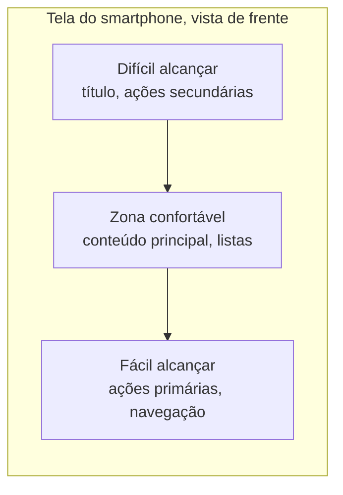

# Aula 4 — Contexto de uso móvel e ergonomia de alcance

**Carga horária:** 4h
**Unidade:** I — O smartphone e a plataforma Android como condicionantes de projeto

## Objetivos da aula

- Caracterizar o contexto de uso móvel em oposição ao uso sentado diante de um computador.
- Aplicar princípios de ergonomia de alcance do polegar ao posicionamento de elementos interativos.
- Distinguir o modelo mental do usuário do modelo do projetista e reconhecer o custo de confundi-los.

## 1. O contexto de uso móvel não é o contexto de uso desktop em tela menor

Um erro conceitual recorrente em projetos iniciantes é tratar o desenvolvimento mobile como "fazer o mesmo site/sistema, só que menor". O contexto de uso do smartphone é qualitativamente diferente:

- **Atenção fragmentada**: o usuário frequentemente interage com o app entre outras tarefas — andando, esperando um ônibus, durante uma conversa — em sessões curtas e interrompidas, raramente em blocos de atenção contínua e exclusiva como diante de um monitor.
- **Interrupção constante**: ligações, notificações de outros apps, a bateria acabando — o app precisa presumir que será interrompido a qualquer momento (retomando o tema da Aula 2) e que a interface deve permitir retomar a tarefa facilmente.
- **Mobilidade física**: o usuário pode estar em movimento, com iluminação variável (sol direto tornando a tela pouco legível) e, frequentemente, usando apenas uma mão.

> **Definição — Contexto de uso**: conjunto de circunstâncias físicas, cognitivas e sociais em que a interação com o sistema ocorre, e que influencia diretamente quais decisões de interface são adequadas.

## 2. Uso com uma mão e ergonomia de alcance do polegar

A pesquisa de Steven Hoober ("How Do Users Really Hold Mobile Devices?", 2013) — um levantamento observacional com mais de 1300 pessoas em uso real, portanto anterior à popularização de telas acima de 6 polegadas — mediu como usuários seguram o aparelho: aproximadamente **49% em pegada de uma mão só** (polegar como único dedo interativo), **36% em pegada "de berço"** (*cradled*: uma mão segura, o outro indicador ou polegar da mesma mão toca), e **15% com as duas mãos**. Ou seja, a maioria das sessões envolve uma única mão interagindo com o polegar — mas os números exatos, e não "a maioria usa uma mão", são o que sustenta a recomendação a seguir com credibilidade, especialmente considerando que telas maiores hoje podem deslocar essa distribuição.

> **Definição — Zona de alcance do polegar**: região da tela que o polegar consegue tocar confortavelmente sem que o usuário precise reposicionar a pegada, tipicamente concentrada na metade inferior da tela e mais estreita nas bordas superiores.

Isso leva a uma convenção consolidada nas interfaces Android modernas:

- **Ações primárias e frequentes** (enviar, confirmar, buscar, navegação principal) posicionadas na parte **inferior** da tela — daí a popularidade de barras de navegação inferior (`BottomNavigationBar`) e botões de ação flutuante (FAB) na base.
- **Informação de contexto e ações secundárias/raras** (voltar, configurações, menu) na parte superior, onde o alcance é mais difícil, mas a frequência de toque é menor.



## 3. Tamanho mínimo de alvo de toque

O dedo humano cobre uma área bem maior que um cursor de mouse, e o toque é impreciso comparado ao clique. O valor de **48dp × 48dp** não é um número isolado — é a convergência de três referências distintas, e vale conhecer as três porque cada uma aparece em contextos diferentes: o **Material Design 3** recomenda 48dp como alvo mínimo recomendado; o **WCAG 2.2**, critério 2.5.8 (nível AA), exige no mínimo 24×24 pixels CSS; e o mesmo WCAG 2.2, critério 2.5.5 (nível AAA), pede 44×44. Na prática, 48dp atende aos três com folga e é o valor a adotar por padrão — mas ao justificar a decisão numa entrega, cite a origem, não apenas o número.

```kotlin
// Jetpack Compose
IconButton(
    onClick = { adicionarAosFavoritos() },
    modifier = Modifier.size(48.dp)
) {
    Icon(Icons.Default.FavoriteBorder, contentDescription = "Adicionar aos favoritos")
}
```

Alvos menores que isso aumentam a taxa de erro de toque, especialmente relevante em cenários de uso em movimento (mão instável, atenção dividida) — outro elo direto entre o contexto de uso e uma decisão de dimensionamento aparentemente puramente visual.

## 4. Modelo mental do usuário x modelo do projetista

> **Definição — Modelo mental**: representação interna e simplificada que uma pessoa constrói sobre como um sistema funciona, construída a partir de experiências anteriores (com o mundo físico e com outros softwares), e que orienta suas expectativas sobre o que vai acontecer ao interagir com um novo sistema.

O erro central que a área de design de interação busca evitar é presumir que o **modelo do projetista** (como o sistema de fato funciona internamente) coincide com o **modelo mental do usuário** (como o usuário espera que funcione). Quando os dois modelos divergem, o usuário comete erros que, do ponto de vista do sistema, "não deveriam acontecer" — mas que, do ponto de vista do usuário, são absolutamente razoáveis dado o que ele espera.

Exemplo clássico em mobile: um usuário que aprendeu, em outros aplicativos, que "deslizar um item de lista para o lado o exclui" tentará esse gesto em qualquer lista nova, mesmo que o aplicativo não tenha implementado esse comportamento — porque seu modelo mental foi formado pela convenção da plataforma, não pela documentação específica daquele app.

## 5. Convenções de plataforma como atalho para o modelo mental correto

Justamente porque o usuário chega ao aplicativo com um modelo mental já formado por outros aplicativos Android, **seguir as convenções da plataforma reduz a carga cognitiva**, mesmo quando uma solução "original" pareceria mais criativa. Isso não significa ausência de identidade visual — significa que a estrutura de interação (onde fica a navegação, como funciona o gesto de voltar, como se comporta um formulário) deve seguir o que o usuário já sabe, reservando a originalidade para a camada visual (cor, tipografia, ilustração), tema retomado na Aula 6.

## 6. Exemplo real: por que apps de banco colocam a ação principal embaixo

Aplicativos bancários brasileiros (Nubank, Itaú, Banco do Brasil) convergiram, ao longo dos últimos anos, para um padrão de navegação inferior com as ações mais usadas (pagar, transferir, extrato) sempre visíveis na base da tela — não por acaso, mas como resposta direta à ergonomia de alcance do polegar combinada com a alta frequência de uso com uma mão só, muitas vezes em pé, no transporte público. Aplicativos que mantêm ações financeiras críticas apenas em menus escondidos no topo (padrão "hambúrguer") tendem a apresentar taxas de conclusão de tarefa piores em testes de usabilidade, exatamente o tipo de medição que será praticado na Aula 5.

## Síntese da aula

| Princípio | Aplicação prática |
|---|---|
| Atenção fragmentada | Tarefas curtas, retomáveis, sem exigir sessões longas ininterruptas |
| Zona de alcance do polegar | Ações primárias embaixo, secundárias em cima |
| Alvo mínimo de toque | 48dp × 48dp, mesmo que o ícone visual seja menor |
| Modelo mental x modelo do projetista | Seguir convenções de plataforma reduz erro de uso |

## Leitura recomendada

- NIELSEN, Jakob; BUDIU, Raluca. *Usabilidade Móvel*. Rio de Janeiro: Elsevier, 2013 — capítulos sobre contexto de uso e interação por toque.
- HOOBER, Steven. "How Do Users Really Hold Mobile Devices?" — referência de pesquisa sobre ergonomia de alcance.

## Atividade da aula

**Avaliação 1 — Estudo do contexto de uso e mapa de restrições de plataforma (peso 15%)**: cada equipe, a partir do produto que desenvolverá ao longo do semestre, deve entregar um documento curto contendo: (1) descrição do contexto de uso típico do usuário-alvo (onde, quando, com que grau de atenção); (2) mapa das restrições de plataforma identificadas nas Aulas 1 a 3 que se aplicam ao produto (energia, memória, densidade de tela, permissões necessárias); (3) para cada restrição, a consequência de projeto que ela impõe. Rubrica detalhada em [`recursos/rubricas/avaliacao-1-contexto-de-uso.md`](../recursos/rubricas/avaliacao-1-contexto-de-uso.md).

**Atividade extra recomendada (15 min, sem peso)**: cada estudante abre o app do próprio banco e mapeia as três ações mais frequentes (pagar, transferir, ver saldo/extrato) contra a zona de alcance do polegar da §2. Gera discussão imediata e conecta a teoria a um produto real que todos já usam.
