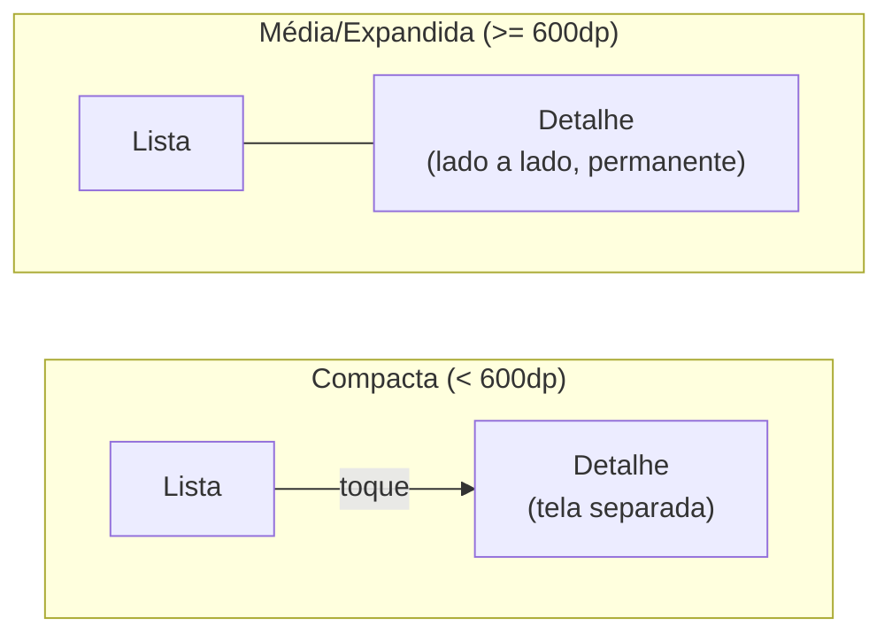

# Aula 7 — Responsividade I: unidades, pontos de quebra e classes de tamanho de janela

**Carga horária:** 4h
**Unidade:** II — Interface, experiência e responsividade

## Objetivos da aula

- Diferenciar layout adaptativo de layout responsivo.
- Aplicar classes de tamanho de janela para tomar decisões estruturais de layout.
- Projetar com layouts canônicos reconhecidos (lista-detalhe, painel de apoio, alimentação).

## 1. Responsivo x adaptativo: uma distinção que importa

> **Definição — Layout responsivo**: layout que se redimensiona e reflui continuamente em resposta ao espaço disponível, usando unidades relativas e regras de flexibilidade (ex.: `Flexbox`, `ConstraintLayout` com pesos), sem pontos de descontinuidade estrutural.

> **Definição — Layout adaptativo**: layout que oferece estruturas distintas e predefinidas para faixas específicas de tamanho de tela (ex.: uma coluna até 600dp, duas colunas acima disso), trocando de estrutura em pontos de quebra determinados, em vez de fluir continuamente.

Na prática, interfaces Android modernas bem-feitas combinam os dois: **responsivas dentro de uma faixa** (um card que cresce e encolhe suavemente) e **adaptativas entre faixas** (a mudança de uma coluna para duas colunas não é gradual, é uma decisão discreta tomada a partir de um ponto de quebra).

## 2. Classes de tamanho de janela (window size classes)

O Android define três classes de tamanho de janela com base na largura disponível (e, de forma equivalente, na altura, para casos como um dobrável em modo paisagem):

| Classe | Largura | Exemplo de aparelho |
|---|---|---|
| **Compacta** | < 600dp | Smartphone em retrato; **também um dobrável fechado**, cuja tela de capa é tipicamente estreita (~330–370dp) |
| **Média** | 600dp – 839dp | Smartphone em paisagem, tablet pequeno em retrato |
| **Expandida** | ≥ 840dp | Tablet grande, **dobrável aberto**, desktop (Chrome OS) |

> **Cuidado com um erro comum**: é tentador presumir que "dobrável fechado" cai na classe média por ser fisicamente maior que um smartphone comum — mas a tela de capa de um dobrável fechado (ex.: Galaxy Z Fold) é estreita, e cai na classe **compacta**. É o dobrável **aberto** que entra na classe expandida. A classe depende da largura disponível de fato, não do porte físico do aparelho.

> **Definição — Classe de tamanho de janela (window size class)**: categoria discreta atribuída ao espaço disponível para a interface, usada como critério de decisão para alternar entre estruturas de layout distintas, em vez de reagir a um valor contínuo de pixels. O Android define classes equivalentes também para a **altura** disponível (`WindowHeightSizeClass`) — relevante, por exemplo, quando o teclado ocupa parte da tela em modo paisagem, reduzindo a altura útil a ponto de mudar a estrutura vertical do layout.

A vantagem de decidir por **classe**, e não por um valor exato de largura, é que o mesmo código de decisão funciona tanto para "este smartphone específico tem 412dp de largura" quanto para "este outro tem 390dp" — ambos caem na classe compacta e recebem o mesmo tratamento estrutural, sem que o desenvolvedor precise enumerar todos os tamanhos possíveis (o que seria inviável dada a fragmentação discutida na Aula 1).

```kotlin
// Jetpack: obtendo a classe de tamanho de janela atual
val windowSizeClass = calculateWindowSizeClass(activity)
when (windowSizeClass.widthSizeClass) {
    WindowWidthSizeClass.COMPACT -> ExibirColunaUnica()
    WindowWidthSizeClass.MEDIUM -> ExibirDuasColunas()
    WindowWidthSizeClass.EXPANDED -> ExibirTresColunas()
}
```

## 3. Pontos de quebra (breakpoints)

> **Definição — Ponto de quebra (breakpoint)**: valor de largura (ou altura) no qual a estrutura do layout muda deliberadamente, definido a partir das classes de tamanho de janela ou de necessidades específicas de conteúdo.

Os valores 600dp e 840dp não são arbitrários: 600dp aproxima a menor largura útil para exibir duas colunas de conteúdo legível lado a lado (dois blocos de ~280dp cada mais espaçamento); 840dp aproxima o espaço necessário para três colunas ou para um painel de navegação permanente somado a conteúdo em duas colunas. Projetos podem definir pontos de quebra adicionais para necessidades específicas de conteúdo (ex.: uma grade de produtos que ganha uma coluna extra a cada 320dp adicionais), mas os três pontos de quebra padrão do Android cobrem a decisão estrutural mais importante: quantos "blocos" de navegação e conteúdo cabem lado a lado.

## 4. Layouts canônicos

O Android define layouts canônicos — estruturas reconhecidas e recomendadas para necessidades de navegação e apresentação de conteúdo recorrentes, que já incorporam as regras de adaptação entre classes de tamanho:

### Lista-detalhe (list-detail)

Uma lista de itens e o detalhe de um item selecionado. Na classe compacta, a lista e o detalhe ocupam telas separadas (navegação por empilhamento, retomando a pilha de retorno da Aula 2); nas classes média e expandida, lista e detalhe são exibidos lado a lado permanentemente, sem necessidade de navegação.



### Painel de apoio (supporting pane)

Um conteúdo principal acompanhado de um painel secundário que fornece contexto (ex.: um player de vídeo com painel de comentários ao lado). Na classe compacta, o painel de apoio fica oculto ou acessível por uma aba/gaveta; nas classes maiores, é exibido permanentemente ao lado do conteúdo principal.

### Alimentação (feed)

Uma grade ou lista de itens homogêneos (ex.: catálogo de produtos, feed de posts) que aumenta o número de colunas conforme o espaço disponível cresce, sem mudar a natureza da navegação — apenas a densidade de itens visíveis por vez.

> **Nota de biblioteca**: no Jetpack Compose, a biblioteca `material3-adaptive` já implementa os três layouts canônicos acima (list-detail, supporting pane, feed) prontos para uso, com a terminologia atualizada de *panes* (painéis) — vale citá-la para quem for implementar o equivalente Android nativo além do que este componente cobre em Flutter/React Native.

## 5. Adaptação a orientação, tablet e aparelho dobrável

A rotação de tela (retrato ↔ paisagem) é, na prática, uma mudança de classe de tamanho de janela: um smartphone compacto em retrato pode entrar na classe média ao girar para paisagem. Um layout construído corretamente em termos de classes de tamanho de janela — e não de "orientação" como conceito separado — trata a rotação como apenas mais uma transição normal entre as mesmas três classes já contempladas, sem lógica duplicada.

O mesmo raciocínio se aplica a tablets (frequentemente na classe expandida) e a dobráveis (que podem transicionar de compacta a expandida em tempo real ao abrir a dobra, retomando o tema da Aula 3) — a interface reage à classe de tamanho de janela corrente, independentemente da causa física da mudança.

## 6. Exemplo real: por que aplicativos de notícias usam lista-detalhe

Aplicativos de notícias e e-mail (Gmail é o exemplo canônico) usam o layout lista-detalhe precisamente porque a tarefa do usuário — escolher um item de uma coleção e consumir seu conteúdo — se beneficia de navegação simplificada em tela pequena e de visão simultânea em tela grande. No Gmail, em um tablet ou em modo paisagem, o usuário vê a caixa de entrada e o e-mail aberto lado a lado, sem perder o contexto da lista ao ler um item — algo impossível de replicar bem em um layout fixo pensado unicamente para smartphone.

## Síntese da aula

| Conceito | Aplicação |
|---|---|
| Classe de tamanho de janela | Decisão estrutural discreta (compacta/média/expandida) |
| Ponto de quebra | Valor de largura onde a estrutura muda |
| Lista-detalhe | Telas separadas → lado a lado |
| Painel de apoio | Oculto/aba → permanente ao lado |
| Alimentação | Colunas aumentam com o espaço, navegação não muda |

## Leitura recomendada

- Documentação oficial: [Support different screen sizes — window size classes](https://developer.android.com/develop/ui/compose/layouts/adaptive/window-size-classes) e [Layouts canônicos](https://developer.android.com/develop/ui/compose/layouts/adaptive/canonical-layouts).

## Atividade da aula

**Prática: projeto de uma tela em três classes de tamanho, no Figma**: a partir da tela redesenhada na Aula 6, produzir três variações (compacta, média, expandida) usando um dos layouts canônicos apresentados como referência estrutural, documentando explicitamente o ponto de quebra escolhido entre cada variação e a justificativa. Use o **Material 3 Design Kit** oficial do Figma — já traz os componentes e os três breakpoints padrão prontos, poupando tempo de montagem que pode ser investido na decisão de layout em si. Antes de montar do zero, vale dois minutos de contraexemplo em aula: rodar um app popular qualquer em um emulador de tablet e observar como ele quebra — a maioria dos apps não testados em tela grande falha visivelmente, e ver isso ao vivo torna o motivo da atividade evidente.
