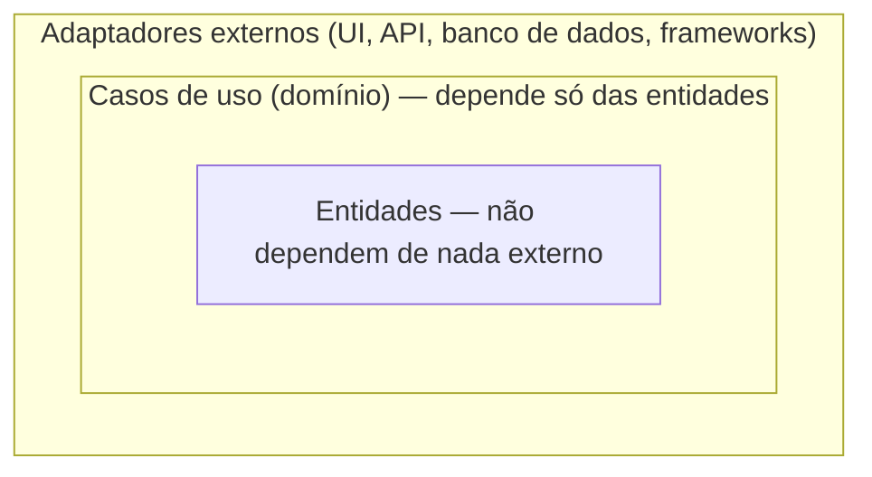

# Aula 17 — Estilos arquiteturais aplicados a aplicações móveis

**Carga horária:** 4h
**Unidade:** V — Estilos arquiteturais, renderização e análise comparativa

## Objetivos da aula

- Distinguir arquitetura em camadas, portas e adaptadores, e arquitetura limpa.
- Explicar a regra de dependência voltada ao domínio.
- Avaliar o acoplamento resultante de cada estilo aplicado a um mesmo módulo mobile.

## 1. Por que revisitar arquitetura agora, depois de já ter implementado dois módulos

Nas Aulas 10 e 14, a separação em camadas (apresentação, domínio, dados) foi tratada de forma prática, como uma regra a seguir. Esta aula formaliza **por que** essa regra existe, nomeando estilos arquiteturais reconhecidos e comparando o grau de rigor de cada um — conhecimento que permite justificar, e não apenas seguir, a estrutura adotada nos dois módulos já entregues (Avaliação 2 e Entrega 2).

> **Definição — Estilo arquitetural**: conjunto de princípios e restrições estruturais que orientam como os componentes de um sistema são organizados e como se relacionam entre si, definindo de antemão que tipos de dependência são permitidos e que tipos são proibidos.

## 2. Arquitetura em camadas (layered architecture)

O estilo já praticado nas Aulas 10 e 14: componentes organizados em camadas horizontais (apresentação, domínio, dados), com a regra de que uma camada só pode depender da camada imediatamente abaixo dela.

> **Definição — Acoplamento**: grau em que um componente depende do funcionamento interno ou da existência de outro componente específico, de forma que uma mudança em um provavelmente exige mudança no outro.

A arquitetura em camadas reduz acoplamento entre apresentação e dados (eles não se conhecem diretamente), mas, em sua forma mais simples, ainda permite que a camada de domínio conheça tipos específicos da camada de dados (ex.: um modelo de domínio que importa diretamente uma classe de resposta de API) — um acoplamento residual que os dois estilos a seguir eliminam de forma mais rigorosa.

## 3. Portas e adaptadores (hexagonal architecture)

> **Definição — Arquitetura de portas e adaptadores (hexagonal)**: estilo arquitetural em que o núcleo da aplicação (domínio) define interfaces abstratas — **portas** — que descrevem o que ele precisa do mundo externo (ex.: "uma forma de obter pedidos"), sem conhecer nenhum detalhe de como isso é implementado; **adaptadores** são implementações concretas dessas portas (ex.: um adaptador que busca pedidos de uma API REST, outro que busca de um banco local), plugáveis e substituíveis sem alterar o núcleo.

> **Por que "hexagonal"**: o nome vem da forma como Alistair Cockburn, autor original do padrão, desenhou o diagrama — um hexágono no centro, com espaço suficiente nas bordas para representar múltiplas portas/adaptadores ao redor. Os seis lados não têm significado técnico específico; é só a forma geométrica escolhida para o desenho, não procure um sentido mais profundo nela.

A diferença central em relação à arquitetura em camadas simples: a dependência é sempre **do adaptador para a porta** (definida pelo domínio), nunca o contrário — o domínio não importa nenhum tipo do adaptador, apenas define a interface que o adaptador deve implementar.

```dart
// Porta: definida pelo domínio, sem conhecer implementação
abstract class PedidoPort {
  Future<List<Pedido>> obterPedidos();
}

// Adaptador: implementação concreta, conhece a porta, não o contrário
class PedidoApiAdapter implements PedidoPort {
  @override
  Future<List<Pedido>> obterPedidos() async {
    final resposta = await _cliente.get('/pedidos');
    return resposta.data.map((json) => Pedido.fromJson(json)).toList();
  }
}
```

O padrão repositório estudado nas Aulas 11 e 15 é, na prática, uma aplicação particular do princípio de portas e adaptadores: a interface `PedidoRepository` é a porta; `PedidoRepositoryImpl` é o adaptador.

## 4. Arquitetura limpa (clean architecture)

> **Definição — Arquitetura limpa**: estilo arquitetural, proposto por Robert C. Martin, que organiza o sistema em círculos concêntricos de dependência — entidades de domínio no centro, casos de uso ao redor, e adaptadores de interface (incluindo apresentação e dados) na camada mais externa — regido pela **regra de dependência**: código-fonte de uma camada só pode referenciar código de camadas mais internas, nunca de camadas mais externas.

> **Definição — Regra de dependência**: princípio segundo o qual as dependências de código-fonte devem apontar sempre para dentro, em direção às políticas de mais alto nível (o domínio), garantindo que mudanças em detalhes externos (um framework de interface, um banco de dados específico) não se propaguem para o núcleo de regras de negócio.



A seta de dependência sempre aponta de fora para dentro: adaptadores externos conhecem casos de uso, casos de uso conhecem entidades — nunca o contrário.

A arquitetura limpa é, em essência, uma formalização mais detalhada do mesmo princípio de portas e adaptadores, com a adição explícita da camada de **casos de uso** (regras de aplicação específicas, ex.: "cancelar um pedido") separada das **entidades** (regras de negócio universais do domínio, ex.: "um pedido tem um total que é a soma de seus itens").

## 4.1. Onde MVVM e MVI se encaixam nesses estilos

Os três estilos das §2–4 descrevem como organizar o sistema **como um todo**. Um degrau abaixo, dentro da camada de apresentação especificamente, existem padrões mais específicos que decidem como a interface se comunica com o estado — os que você provavelmente vai encontrar nomeados em uma vaga de desenvolvimento Android:

> **Definição — MVVM (Model-View-ViewModel)**: padrão de apresentação em que a View observa um ViewModel que expõe estado e comandos, sem o ViewModel conhecer a View diretamente — o Provider/Riverpod consumido por um `ConsumerWidget` (Aula 10) ou um hook customizado consumido por um componente (Aula 14) cumprem, na prática, o papel de ViewModel.

> **Definição — MVI (Model-View-Intent)**: padrão de apresentação em que toda interação do usuário é modelada como uma **intenção** (evento) explícita, processada de forma unidirecional para produzir um novo estado imutável — o BLoC (Aula 10) é, em espírito, uma implementação de MVI: eventos de entrada, estados de saída, fluxo estritamente unidirecional.

Ou seja: MVVM/MVI não competem com camadas/portas-e-adaptadores/arquitetura limpa — eles descrevem a organização *interna* da camada de apresentação, dentro de qualquer um dos três estilos macro já estudados.

## 5. Isolamento do framework: o que muda entre plataformas, o que permanece

A razão prática pela qual esta aula importa para os dois módulos já entregues: se o domínio e os casos de uso de um módulo de pedidos foram escritos respeitando a regra de dependência (sem importar `Widget`, `StatefulWidget`, `useState`, ou qualquer tipo específico de Flutter ou React Native), essa camada é, em princípio, portável entre os dois frameworks quase sem alteração — apenas os adaptadores externos (apresentação e, parcialmente, dados) precisam ser reescritos.

> **Consequência de projeto direta para este componente**: comparar a implementação Flutter (Aula 12) com a implementação React Native (Aula 16) do mesmo módulo é, em grande parte, uma comparação entre **adaptadores** de um mesmo domínio — quanto mais rigorosamente a regra de dependência foi seguida em cada implementação, mais "limpa" e isolável essa comparação se torna, e menos as duas implementações deveriam divergir na lógica de negócio em si.

## 6. Comparação dos três estilos

| Estilo | Rigor de isolamento do domínio | Custo de adoção |
|---|---|---|
| Camadas simples | Moderado — domínio pode conhecer tipos de dados | Baixo, fácil de introduzir em projeto pequeno |
| Portas e adaptadores | Alto — domínio nunca conhece implementação concreta | Médio — exige definir interfaces antecipadamente |
| Arquitetura limpa | Alto, com separação adicional de casos de uso | Alto — mais classes e indireção, pode ser excessivo para módulos pequenos |

> **Observação de projeto**: nenhum dos três estilos é universalmente superior — a arquitetura limpa aplicada a uma tela de configurações simples com três campos é, provavelmente, sobre-engenharia; camadas simples aplicadas a um domínio financeiro complexo, com múltiplas fontes de dados e regras de negócio elaboradas, provavelmente subdimensiona o isolamento necessário. A escolha deve ser justificada pela complexidade e pela expectativa de evolução do módulo, tema que se conecta diretamente à modularização estudada na Aula 18.

## 7. Exemplo real: por que times que mantêm apps em duas plataformas investem em domínio isolado

Equipes que mantêm simultaneamente uma versão Flutter e uma versão React Native do mesmo produto — cenário raro, mas didaticamente relevante — relatam que o principal fator de sucesso na manutenção de paridade entre as duas versões é justamente o quanto a lógica de domínio (regras de validação, cálculo de preço, elegibilidade de desconto) foi isolada de detalhes de framework. Quando o domínio está bem isolado (mesmo que reescrito, não compartilhado literalmente entre Dart e TypeScript), uma mudança de regra de negócio é replicada de forma mecânica e verificável entre as duas bases; quando o domínio está espalhado pela camada de apresentação, cada mudança exige uma investigação separada em cada plataforma, aumentando o risco de divergência não intencional entre elas — exatamente o risco que a Unidade V busca tornar visível antes da análise comparativa final (Aula 20).

## Síntese da aula

| Conceito | Aplicação |
|---|---|
| Regra de dependência | Dependências sempre apontam para dentro, em direção ao domínio |
| Porta | Interface definida pelo domínio |
| Adaptador | Implementação concreta de uma porta, substituível |
| Isolamento de framework | Base para comparação justa entre implementações Flutter e React Native |

## Leitura recomendada

- MARTIN, Robert C. *Arquitetura Limpa*. Rio de Janeiro: Alta Books, 2019.
- RICHARDS, Mark; FORD, Neal. *Fundamentals of Software Architecture*. Sebastopol: O'Reilly Media, 2020 — capítulo sobre estilos arquiteturais.

## Ferramentas que tornam a regra de dependência verificável, não apenas combinada

A melhor forma de ensinar arquitetura é transformar a regra de dependência em uma verificação automática, não em um acordo de cavalheiros que qualquer PR pode violar sem que ninguém perceba: `import_lint`/`dart_code_metrics` (Dart/Flutter) e `eslint-plugin-boundaries` (TypeScript/React Native) **falham o build** quando o domínio importa um tipo de framework. Vale configurar ao menos um deles no módulo da equipe.

## Atividade da aula

**Exercício: reorganização do módulo segundo portas e adaptadores, com análise em papel da arquitetura limpa**: em uma aula de 4h, reorganizar completamente o domínio segundo **dois** estilos adicionais é ambicioso demais para produzir algo terminado. Escopo recomendado: cada equipe reorganiza o domínio do módulo já implementado (Aulas 10-12 e 14-16) segundo o estilo de portas e adaptadores (se ainda não seguido rigorosamente), documentando quais dependências de framework vazavam para o domínio e foram eliminadas. Em seguida, faz uma **análise em papel** (sem reescrever o código) do que mudaria ao migrar para arquitetura limpa completa: quantas classes a mais, que indireção adicional, e se o ganho de isolamento compensaria o custo para este módulo específico — produzindo uma tabela comparativa de acoplamento entre as três versões (camadas simples, portas e adaptadores, arquitetura limpa) com a terceira coluna preenchida por análise, não por implementação.
